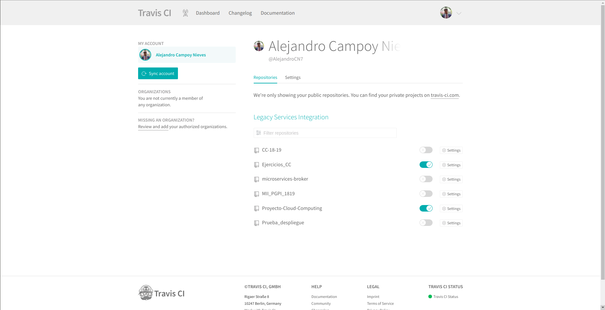
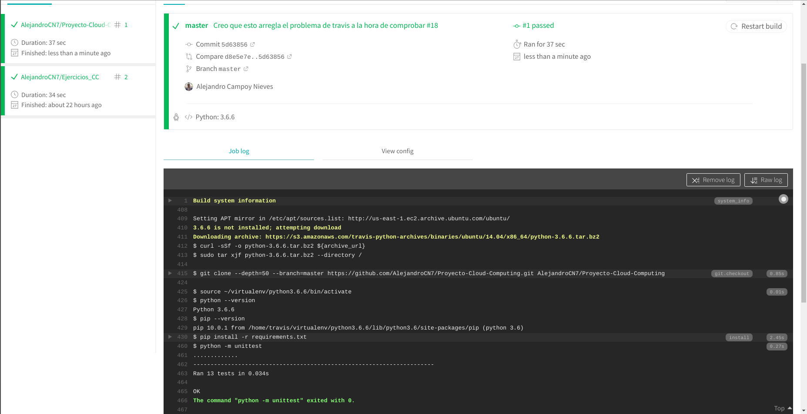
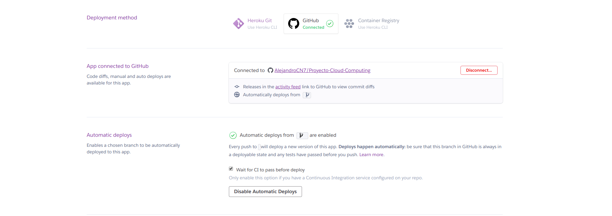

# Servicio de búsqueda para jugadores de videojuegos

---

**Autor: Alejandro Campoy Nieves**

**Asignatura: Cloud Computing (Máster Profesional en Ingeniería Informática)**

**Universidad: Universidad de Granada (UGR)**

## Descripción del problema

---

Cada vez es más común encontrarse videojuegos en el mercado totalmente centrados
en el modo **online** cooperativo o competitivo con otros jugadores. Los videojuegos
offline o de modo historia siguen teniendo éxito coexistiendo con los
anteriormente mencionados. Es muy común encontrarse con gente que le atrae un
videojuego pero simplemente no puede disfrutarlo al máximo porque no tiene con
quien jugarlo y esto reduce su experiencia como jugador.

Aunque siga habiendo de todo, los juegos online y los [deportes
electrónicos](https://es.wikipedia.org/wiki/Deportes_electr%C3%B3nicos) de jugadores en este
proyecto.

## Descripción de la solución

---

La idea consiste en crear una **plataforma** en la cual puedan **registrarse** los
jugadores de videojuegos especificando sus datos (nombre, edad, plataforma de juego, etc).
Entonces, el jugador en cuestión tendrá la posibilidad de especificar a qué videojuegos
está jugando en la actualidad y con qué frecuencia. A su vez, se desarrollará un
**buscador** de otros perfiles mediante distintos criterios de búsqueda, como un
videojuego en concreto al que esté jugando. Con ello permitiremos que jugadores
con gustos y objetivos similares dentro de un videojuego puedan ponerse en **contacto**
y disfrutar de la experiencia extra que supone degustar un videojuego en compañía.

## Arquitectura

---

Se pretende realizar un despliegue en la nube utilizando para ello una arquitectura basada en
[microservicios](https://www.redhat.com/es/topics/microservices). De esta forma tenemos la posibilidad de dar un servicio grande
presentándolo como un conjunto de pequeños servicios (microservicios) que funcionan
de una forma totalmente independiente (aunque luego se comuniquen y colaboren entre ellos). En función de las necesidades que se han especificado en la descripción de la solución, inicialmente, planteo el desarrollo de los siguientes microservicios:

- Gestión de usuarios (Sing up, log in, modificación del perfil de usuario...).

- Gestión de la base de datos MongoDB.

- Microservicio de búsqueda de jugadores por criterio.

- Microservicio para mostrar la información de una forma determinada.

## Comunicación entre microservicios y Servicio web

---

Tal y como se ha mencionado en clase, la idea es comunicar los microservicios con un broker llamado [RabbitMQ](https://www.rabbitmq.com/).

Las peticiones al servidor se realizarán utilizando [API REST](https://bbvaopen4u.com/es/actualidad/api-rest-que-es-y-cuales-son-sus-ventajas-en-el-desarrollo-de-proyectos). Implementando las peticiones HTTP usuales como GET, POST, DELETE y PUT. Veremos más adelante como poder hacer esto.

## Desarrollo

---

El lenguaje que vamos a utilizar para implementar cada uno de los microservicios mencionados anteriormente va a ser, en principio, [Python](https://www.python.org/). Va a ser vinculado a una base de datos no relacional llamada [MongoDB](https://www.mongodb.com/es) a través de [Pymongo](https://api.mongodb.com/python/current/), que es una distribución de Python la cual contiene herramientas para trabajar con esta base de datos. Además, vamos a hacer uso de un framework para desarrollo web llamado [Flask](http://flask.pocoo.org/) cuya finalidad es facilitarnos en cierta medida el trabajo de desarrollo y montaje del servicio web. Además, haremos uso de un microframework específico dentro de lo que es Flask para poder diseñar la API REST de una forma más cómoda, se llama [Flask RESTful](https://flask-restful.readthedocs.io/en/latest/)

## Pruebas y test

---

En principio, para realizar un desarrollo basado en pruebas, haremos uso de [Unittest](https://docs.python.org/3/library/unittest.html) para Python, aunque no se descarta utilizar algún marco que nos ayude a crearlos en un alto nivel como puede ser [Pocha](https://github.com/rlgomes/pocha) ([Mocha](https://mochajs.org/) para Python). Además, debemos tener en cuenta que queremos automatizar el proceso todo lo posible, de tal forma que cuando actualicemos el repositorio de Github se comprueben los tests realizados en Unittest y nos notifique cuando haya algún tipo de problema. Siempre intentando manterner el mayor porcentaje de cobertura posible en el software que se diseña.

## Despliegue

---

Despliegue: https://pruebacc.herokuapp.com/

El despliegue del servivio web se llevará a cabo utilizando [Heroku](https://devcenter.heroku.com/), siguiendo la filosofía de plataforma como un servicio (Paas) en la nube. Esto nos permite tener a nuestra disposición un servidor en el que poder desplegar nuestro proyecto en la nube de forma gratuita. El ser gratuito implica que tenemos limitaciones a la hora de hacerlo, pero no nos supone un problema para realizar los primeros pasos de este proyecto.

Todos los datos que se reciben desde el servidor están en formato [JSON](https://es.wikipedia.org/wiki/JSON). El enlace de despliegue que se acaba de mostrar nos permite hacer un GET (o cualquier otra orden, pero esta es la que hace un navegador web por defecto) a la raíz de nuestro servicio web con la finalidad de obtener el recurso. Los recursos que tenemos ahora mismo desplegados son:

- [/](https://pruebacc.herokuapp.com/) : Nos permite acceder a la raíz en la que se muestra status:OK en caso de que este levantado el servidor.
- [/principal](https://pruebacc.herokuapp.com/principal): Hace exactamente lo mismo que la raíz, es una prueba que realice para comprobar si podía poner el mismo recurso en más de una ruta.
- [/jugadores](https://pruebacc.herokuapp.com/jugadores): Muestra datos de un conjunto de 3 jugadores que se han creado como clase para este servicio.
- [/jugadores/jugador1](https://pruebacc.herokuapp.com/jugadores/jugador1): Muestra únicamente los datos del primer jugador.
- [/jugadores/jugador2](https://pruebacc.herokuapp.com/jugadores/jugador2): Muestra únicamente los datos del segundo jugador.
- [/jugadores/jugador3](https://pruebacc.herokuapp.com/jugadores/jugador3): Muestra únicamente los datos del tercer jugador.

### Funcionalidad

#### Model.py

El archivo [model.py](https://github.com/AlejandroCN7/Proyecto-Cloud-Computing/blob/master/model.py) se encuentra en la raíz de este repositorio. Aquí he implementado la clase Jugador con la que generaré los datos con los que trabajará al servicio web que desarrollaremos más adelante. Básicamente una instancia de la clase Jugador tiene los siguientes datos:

- **Nick** : Es el alias característico de cada uno de los jugadores (tipo str).
- **Nombre**: Nombre real del jugador (tipo str).
- **Apellidos**: Apellidos del jugador (tipo str).
- **Edad**: Edad del jugador (tipo int).
- **Videojuegos**: Videojuegos a los que suele jugar este jugador (lista de Python).
- **Competitivo**: Indica si el jugador compite en algún equipo de deportes electrónicos o no (tipo bool)

A parte tiene definidas algunos métodos como añadir un nuevo videojuego a la lista o eliminarlo, poder modificar el Nick y poder convertir los datos de la instancia en un diccionario. El objetivo de esto último es poder tener las instancias de jugadores representadas por diccionarios de Python debido a que son muy parecidos al formato JSON, de tal modo que Flask RESTful trabaja muy bien con estos contenedores y los transforma automáticamente a JSON, añadiendo incluso la cabecera.

#### principal.py

El archivo [principal.py](https://github.com/AlejandroCN7/Proyecto-Cloud-Computing/blob/master/principal.py) también se encuentra en la raíz del repositorio y en el hemos creado el API REST con el que damos el servicio web. Para ello, como ya hemos mencionado anteriormente, hemos utilizado la ayuda de Flask y Flask RESTful. Con esta implementación ya podemos realizar el despliegue como localhost en el computador sin la necesidad de nada más y poder probar como se comporta el modelo con peticiones al servicio. Dependiendo de la ruta hemos diseñado distintas peticiones:

- Para la raíz un GET que devuelva status:ok en JSON.
- Para */jugadores* un GET que nos devuelve un JSON de los tres jugadores creados y un POST para añadir un nuevo jugador a la lista de jugadores (creando un recurso nuevo en una ruta nueva)
- Para */jugadores/jugador?* hemos implementado un GET para obtener los datos concretos de ese jugador en formato JSON, un DELETE para borrar el recurso y, por tanto, la ruta y un PUT que, dependiendo de si la ruta ya existe o no, crea o modifica un recurso (vamos, un jugador).

Cabe destacar que Flask RESTful crea las cabeceras de los paquetes de respuesta del servidor automáticamente. Se especifica que el tipo MIME es JSON y el código de estado también lo devuelve de una forma automática, aunque podemos especificar nosotros mismo que código determinado queremos que muestre en la cabecera dependiendo de la situación (ver algunos returns del archivo). Esto me parece muy útil porque no hay necesidad de implementar cada una de las cabeceras típicas que se devuelven, solo cuando queremos especificar un detalle concreto es necesario especificar este tipo de cosas.

Las líneas:
~~~
if (__name__ == '__main__'):
    # Esto es para que pueda abrirse desde cualquier puerto y direccion(de esta forma en heroku no nos da error).
    port = int(os.environ.get("PORT", 5000))
    app.run(host="0.0.0.0", port=port,debug=True)
~~~

Se han realizado de esta forma debido a un problema que tuve durante el desarrollo. Resulta que al tener el puerto 5000 y el host 127.0.0.1, Heroku no podía desplegar la aplicación correctamente.

#### test_model.py & test_web.py

Ya tenemos tanto el modelo, como la API REST con la que los clientes van a poder realizar peticiones a ese servicio. El siguiente paso que he llevado a cabo consiste en realizar unos test ayudándome de Unittest con la finalidad de dar la máxima cobertura al software desarrollado, tanto en la clase modelo ([test_model.py](https://github.com/AlejandroCN7/Proyecto-Cloud-Computing/blob/master/test_model.py)), como en la API REST realizada ([test_web.py]()). De esta forma si en el futuro se intenta actualizar la versión de Python o cualquier otro tipo de cambio es producido en el entorno, podemos saber de una forma rápida y bastante precisa como puede influir negativamente esto en lo que tenemos hecho, y poder amoldarlo de nuevo para que continúe funcionando. Se ha intentado testear todo.

### Definición de la Infraestructura

Recordemos que el objetivo es desplegar todo lo que se esta desarrollando en Heroku. La definición de la infraestructura es fundamental. Aunque vincule Heroku a mi repositorio de Github, no ocurrirá nada si no especifico los datos necesarios para que Heroku sepa como debe realizar ese despliegue, eso es lo que se entiende por infraestructura.

Entonces, he creado y añadido a la raíz del repositorio los siguientes archivos:

- [requirements.txt](https://github.com/AlejandroCN7/Proyecto-Cloud-Computing/blob/master/requirements.txt): He creado un entorno virtual en Python ayudándome con [virtualenv](https://virtualenv.pypa.io/en/latest/) para instalar justo lo que necesitaba para este despliegue. Básicamente es Flask, Flask RESTful y Gunicorn (hablaré de Gunicorn más adelante). Aunque para crear el archivo de requirements he hecho uso de [pipreqs](https://github.com/bndr/pipreqs) en lugar de pip freeze dado que este analiza el proyecto y pone justo lo que necesitamos.
- [runtime.txt](https://github.com/AlejandroCN7/Proyecto-Cloud-Computing/blob/master/runtime.txt): En este archivo solo tenemos que especificar la versión de Python que queremos que se utilice en el despliegue y que, por tanto, utilice el servidor (por lo tanto, no tiene por qué ser exactamente el mismo con el que hemos realizado la implementación necesariamente). En mi caso he seleccionado Python 3.6.6 porque es el que tenía instalado en mi computador y seleccionado en el entorno virtual con el que desarrollé toda el código.
- [Procfile](https://github.com/AlejandroCN7/Proyecto-Cloud-Computing/blob/master/Procfile): Solo tengo especificado en su interior la siguiente línea:
`web: gunicorn principal:app`
La palabra "web" sirve para especificar que se trata de un proceso que tiene que realizar Heroku y que puede recibir tráfico externo en forma HTTP (justo con lo que consiste una API REST). Lo siguiente es el comando que se va a ejecutar. Le especificamos que ejecute [Gunicorn](https://gunicorn.org/), que es un servidor WSGI HTTP para Python que nos permite correr el servidor. He seleccionado este porque es complatible con Flask. Lo último es especificar que para saber lo que tiene que correr tiene que mirar en *principal.py*, concretamente la instancia llamada "app" de Flask que hemos creado.

### Test con Travis

Como ya sabemos, realizamos los test con Unittest. Sin embargo, queremos automatizar la ejecución de los mismos de tal forma que cada vez que actualicemos el repositorio de Github se ejecuten para comprobar si hay algún problema.

Para conseguir esto, he vinculado la cuenta de Github con Travis a través de su página web y he especificado los repositorios que quiero que revise cada vez que los actualice como se aprecia en la siguiente imagen.

Sin embargo, esto no es suficiente. Debemos de especificarle a Travis donde están los archivos que contienen los tests y como debe ejecutarlos para poder comprobarlos. Supongo que esto se puede considerar también parte de la infraestructura. Para ello he creado el archivo [.travis.yml](https://github.com/AlejandroCN7/Proyecto-Cloud-Computing/blob/master/.travis.yml) en la raíz del repositorio. De esta forma Travis siempre ejecuta este archivo y ve que tiene que utilizar Python para ejecutar test_model.py t test_web-py con unittest.

Cada vez que actualizamos el repositorio a partir de este momento debería de aparecer en la página web de Travis algo parecido a la siguiente imagen si todo ha salido bien.

### Vinculación con Heroku

Para vincular con Heroku podemos hacerlo de dos formas principalmente: desde su interfaz en su página web o desde la terminal (yo lo he hecho en Ubuntu 18.04 LTS) instalando Heroku CLI. El tema de crear el proyecto lo he realizado de las dos formas y es algo sencillo.

Una vez tenemos creado el proyecto de Heroku debemos de vincularlo con nuestra Github, especificando el repositorio concreto con el que queremos que se vincule. Entonces, tendremos la posibilidad de activar el despliegue automático cada vez que actualicemos el repositorio. Sin embargo, es muy importante marcar la opción en la que pone "Wait for CI to pass before deploy" para que no se despliegue en caso de que no pase los tests en Travis. ¿Sino para que he empleado tiempo en hacerlo?

A partir de ahora, cada vez que actualicemos el repositorio debería de desplegarse en Heroku. Podemos ver el proceso de este despliegue desde la interfaz de Heroku o desde Github accediendo en la pestaña llamada "environments" como se aprecia en la siguiente imagen:

## Provisionamiento

El provisionamiento se realizará con [Ansible](https://www.ansible.com/).

## Orquestación

Hitos futuros.

## Contenedores

Hitos futuros.

## Licencia

---

Este proyecto está bajo la licencia de [GNU GENERAL PUBLIC LICENSE](https://es.wikipedia.org/wiki/GNU_General_Public_License)
