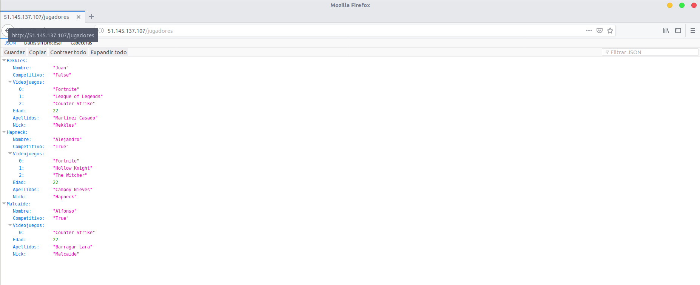
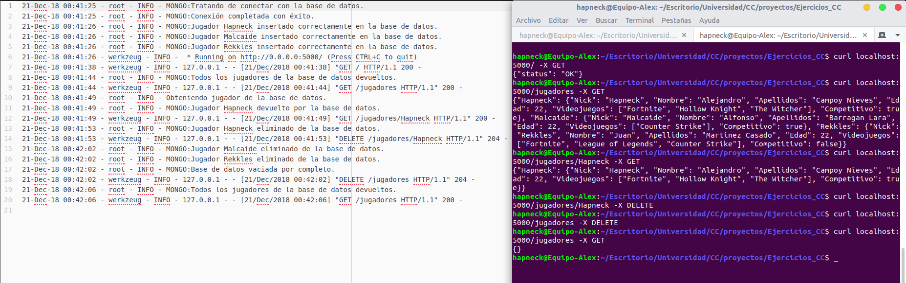
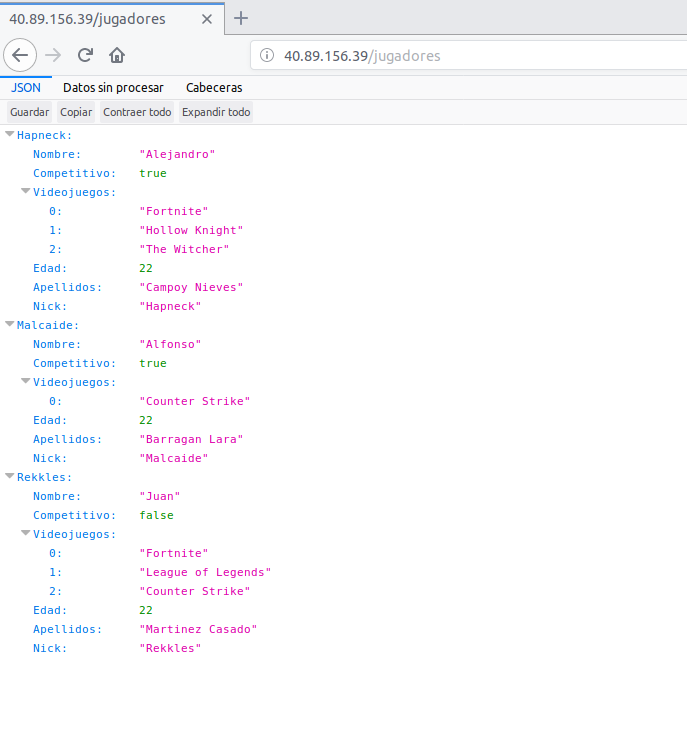

# Servicio de búsqueda para jugadores de videojuegos

---

**Autor: Alejandro Campoy Nieves**

**Asignatura: Cloud Computing (Máster Profesional en Ingeniería Informática)**

**Universidad: Universidad de Granada (UGR)**

## Descripción del problema

---

Cada vez es más común encontrarse videojuegos en el mercado totalmente centrados
en el modo **online** cooperativo o competitivo con otros jugadores. Los videojuegos
offline o de modo historia siguen teniendo éxito coexistiendo con los
anteriormente mencionados. Es muy común encontrarse con gente que le atrae un
videojuego pero simplemente no puede disfrutarlo al máximo porque no tiene con
quien jugarlo y esto reduce su experiencia como jugador.

Aunque siga habiendo de todo, los juegos online y los [deportes
electrónicos](https://es.wikipedia.org/wiki/Deportes_electr%C3%B3nicos) de jugadores en este
proyecto.

## Descripción de la solución

---

La idea consiste en crear una **plataforma** en la cual puedan **registrarse** los
jugadores de videojuegos especificando sus datos (nombre, edad, plataforma de juego, etc).
Entonces, el jugador en cuestión tendrá la posibilidad de especificar a qué videojuegos
está jugando en la actualidad y con qué frecuencia. A su vez, se desarrollará un
**buscador** de otros perfiles mediante distintos criterios de búsqueda, como un
videojuego en concreto al que esté jugando. Con ello permitiremos que jugadores
con gustos y objetivos similares dentro de un videojuego puedan ponerse en **contacto**
y disfrutar de la experiencia extra que supone degustar un videojuego en compañía.

## Arquitectura

---

Se pretende realizar un despliegue en la nube utilizando para ello una arquitectura basada en
[microservicios](https://www.redhat.com/es/topics/microservices). De esta forma tenemos la posibilidad de dar un servicio grande
presentándolo como un conjunto de pequeños servicios (microservicios) que funcionan
de una forma totalmente independiente (aunque luego se comuniquen y colaboren entre ellos). En función de las necesidades que se han especificado en la descripción de la solución, inicialmente, planteo el desarrollo de los siguientes microservicios:

- Gestión de usuarios (Sign up, log in, modificación del perfil de usuario...).

- Gestión de la base de datos MongoDB.

- Microservicio de búsqueda de jugadores por criterio.

- Microservicio para mostrar la información de una forma determinada.

## Comunicación entre microservicios y Servicio web

---

Tal y como se ha mencionado en clase, la idea es comunicar los microservicios con un broker llamado [RabbitMQ](https://www.rabbitmq.com/).

Las peticiones al servidor se realizarán utilizando [API REST](https://bbvaopen4u.com/es/actualidad/api-rest-que-es-y-cuales-son-sus-ventajas-en-el-desarrollo-de-proyectos). Implementando las peticiones HTTP usuales como GET, POST, DELETE y PUT. Veremos más adelante como poder hacer esto.

## Desarrollo

---

El lenguaje que vamos a utilizar para implementar cada uno de los microservicios mencionados anteriormente va a ser, en principio, [Python](https://www.python.org/). Va a ser vinculado a una base de datos no relacional llamada [MongoDB](https://www.mongodb.com/es) a través de [Pymongo](https://api.mongodb.com/python/current/), que es una distribución de Python la cual contiene herramientas para trabajar con esta base de datos. Además, vamos a hacer uso de un framework para desarrollo web llamado [Flask](http://flask.pocoo.org/) cuya finalidad es facilitarnos en cierta medida el trabajo de desarrollo y montaje del servicio web. Además, haremos uso de un microframework específico dentro de lo que es Flask para poder diseñar la API REST de una forma más cómoda, se llama [Flask RESTful](https://flask-restful.readthedocs.io/en/latest/)

## Pruebas y test

---

En principio, para realizar un desarrollo basado en pruebas, haremos uso de [Unittest](https://docs.python.org/3/library/unittest.html) para Python, aunque no se descarta utilizar algún marco que nos ayude a crearlos en un alto nivel como puede ser [Pocha](https://github.com/rlgomes/pocha) ([Mocha](https://mochajs.org/) para Python). Además, debemos tener en cuenta que queremos automatizar el proceso todo lo posible, de tal forma que cuando actualicemos el repositorio de Github se comprueben los tests realizados en Unittest y nos notifique cuando haya algún tipo de problema. Siempre intentando manterner el mayor porcentaje de cobertura posible en el software que se diseña.

## Despliegue

---

Despliegue: https://pruebacc.herokuapp.com/

El despliegue del servicio web se llevará a cabo utilizando [Heroku](https://devcenter.heroku.com/), siguiendo la filosofía de plataforma como un servicio (PaaS) en la nube. Esto nos permite tener a nuestra disposición un servidor en el que poder desplegar nuestro proyecto en la nube de forma gratuita. El ser gratuito implica que tenemos limitaciones a la hora de hacerlo, pero no nos supone un problema para realizar los primeros pasos de este proyecto.

Todos los datos que se reciben desde el servidor están en formato [JSON](https://es.wikipedia.org/wiki/JSON). El enlace de despliegue que se acaba de mostrar nos permite hacer un GET (o cualquier otra orden, pero esta es la que hace un navegador web por defecto) a la raíz de nuestro servicio web con la finalidad de obtener el recurso. Los recursos que tenemos ahora mismo desplegados son:

- [/](https://pruebacc.herokuapp.com/) : Nos permite acceder a la raíz en la que se muestra status:OK en caso de que este levantado el servidor.
- [/principal](https://pruebacc.herokuapp.com/principal): Hace exactamente lo mismo que la raíz, es una prueba que realice para comprobar si podía poner el mismo recurso en más de una ruta.
- [/jugadores](https://pruebacc.herokuapp.com/jugadores): Muestra datos de un conjunto de 3 jugadores que se han creado como clase para este servicio.
- [/jugadores/jugador1](https://pruebacc.herokuapp.com/jugadores/jugador1): Muestra únicamente los datos del primer jugador.
- [/jugadores/jugador2](https://pruebacc.herokuapp.com/jugadores/jugador2): Muestra únicamente los datos del segundo jugador.
- [/jugadores/jugador3](https://pruebacc.herokuapp.com/jugadores/jugador3): Muestra únicamente los datos del tercer jugador.

### Funcionalidad

#### Model.py

El archivo [model.py](https://github.com/AlejandroCN7/Proyecto-Cloud-Computing/blob/master/model.py) se encuentra en la raíz de este repositorio. Aquí he implementado la clase Jugador con la que generaré los datos con los que trabajará al servicio web que desarrollaremos más adelante. Básicamente una instancia de la clase Jugador tiene los siguientes datos:

- **Nick** : Es el alias característico de cada uno de los jugadores (tipo str).
- **Nombre**: Nombre real del jugador (tipo str).
- **Apellidos**: Apellidos del jugador (tipo str).
- **Edad**: Edad del jugador (tipo int).
- **Videojuegos**: Videojuegos a los que suele jugar este jugador (lista de Python).
- **Competitivo**: Indica si el jugador compite en algún equipo de deportes electrónicos o no (tipo bool)

A parte tiene definidas algunos métodos como añadir un nuevo videojuego a la lista o eliminarlo, poder modificar el Nick y poder convertir los datos de la instancia en un diccionario. El objetivo de esto último es poder tener las instancias de jugadores representadas por diccionarios de Python debido a que son muy parecidos al formato JSON, de tal modo que Flask RESTful trabaja muy bien con estos contenedores y los transforma automáticamente a JSON, añadiendo incluso la cabecera.

#### principal.py

El archivo [principal.py](https://github.com/AlejandroCN7/Proyecto-Cloud-Computing/blob/master/principal.py) también se encuentra en la raíz del repositorio y en el hemos creado el API REST con el que damos el servicio web. Para ello, como ya hemos mencionado anteriormente, hemos utilizado la ayuda de Flask y Flask RESTful. Con esta implementación ya podemos realizar el despliegue como localhost en el computador sin la necesidad de nada más y poder probar como se comporta el modelo con peticiones al servicio. Dependiendo de la ruta hemos diseñado distintas peticiones:

- Para la raíz un GET que devuelva status:ok en JSON.
- Para */jugadores* un GET que nos devuelve un JSON de los tres jugadores creados y un POST para añadir un nuevo jugador a la lista de jugadores (creando un recurso nuevo en una ruta nueva)
- Para */jugadores/jugador?* hemos implementado un GET para obtener los datos concretos de ese jugador en formato JSON, un DELETE para borrar el recurso y, por tanto, la ruta y un PUT que, dependiendo de si la ruta ya existe o no, crea o modifica un recurso (vamos, un jugador).

Cabe destacar que Flask RESTful crea las cabeceras de los paquetes de respuesta del servidor automáticamente. Se especifica que el tipo MIME es JSON y el código de estado también lo devuelve de una forma automática, aunque podemos especificar nosotros mismo que código determinado queremos que muestre en la cabecera dependiendo de la situación (ver algunos returns del archivo). Esto me parece muy útil porque no hay necesidad de implementar cada una de las cabeceras típicas que se devuelven, solo cuando queremos especificar un detalle concreto es necesario especificar este tipo de cosas.

Las líneas:
~~~
if (__name__ == '__main__'):
    # Esto es para que pueda abrirse desde cualquier puerto y direccion(de esta forma en heroku no nos da error).
    port = int(os.environ.get("PORT", 5000))
    app.run(host="0.0.0.0", port=port,debug=True)
~~~

Se han realizado de esta forma debido a un problema que tuve durante el desarrollo. Resulta que al tener el puerto 5000 y el host 127.0.0.1, Heroku no podía desplegar la aplicación correctamente.

#### test_model.py & test_web.py

Ya tenemos tanto el modelo, como la API REST con la que los clientes van a poder realizar peticiones a ese servicio. El siguiente paso que he llevado a cabo consiste en realizar unos test ayudándome de Unittest con la finalidad de dar la máxima cobertura al software desarrollado, tanto en la clase modelo ([test_model.py](https://github.com/AlejandroCN7/Proyecto-Cloud-Computing/blob/master/test_model.py)), como en la API REST realizada ([test_web.py](https://github.com/AlejandroCN7/Proyecto-Cloud-Computing/blob/master/test_web.py)). De esta forma si en el futuro se intenta actualizar la versión de Python o cualquier otro tipo de cambio es producido en el entorno, podemos saber de una forma rápida y bastante precisa como puede influir negativamente esto en lo que tenemos hecho, y poder amoldarlo de nuevo para que continúe funcionando. Se ha intentado testear todo.

### Definición de la Infraestructura

Recordemos que el objetivo es desplegar todo lo que se esta desarrollando en Heroku. La definición de la infraestructura es fundamental. Aunque vincule Heroku a mi repositorio de Github, no ocurrirá nada si no especifico los datos necesarios para que Heroku sepa como debe realizar ese despliegue, eso es lo que se entiende por infraestructura.

Entonces, he creado y añadido a la raíz del repositorio los siguientes archivos:

- [requirements.txt](https://github.com/AlejandroCN7/Proyecto-Cloud-Computing/blob/master/requirements.txt): He creado un entorno virtual en Python ayudándome con [virtualenv](https://virtualenv.pypa.io/en/latest/) para instalar justo lo que necesitaba para este despliegue. Básicamente es Flask, Flask RESTful y Gunicorn (hablaré de Gunicorn más adelante). Aunque para crear el archivo de requirements he hecho uso de [pipreqs](https://github.com/bndr/pipreqs) en lugar de pip freeze dado que este analiza el proyecto y pone justo lo que necesitamos.
- [runtime.txt](https://github.com/AlejandroCN7/Proyecto-Cloud-Computing/blob/master/runtime.txt): En este archivo solo tenemos que especificar la versión de Python que queremos que se utilice en el despliegue y que, por tanto, utilice el servidor (por lo tanto, no tiene por qué ser exactamente el mismo con el que hemos realizado la implementación necesariamente). En mi caso he seleccionado Python 3.6.6 porque es el que tenía instalado en mi computador y seleccionado en el entorno virtual con el que desarrollé toda el código.
- [Procfile](https://github.com/AlejandroCN7/Proyecto-Cloud-Computing/blob/master/Procfile): Solo tengo especificado en su interior la siguiente línea:
`web: gunicorn principal:app`
La palabra "web" sirve para especificar que se trata de un proceso que tiene que realizar Heroku y que puede recibir tráfico externo en forma HTTP (justo con lo que consiste una API REST). Lo siguiente es el comando que se va a ejecutar. Le especificamos que ejecute [Gunicorn](https://gunicorn.org/), que es un servidor WSGI HTTP para Python que nos permite correr el servidor. He seleccionado este porque es compatible con Flask. Lo último es especificar que para saber lo que tiene que correr tiene que mirar en *principal.py*, concretamente la instancia llamada "app" de Flask que hemos creado.

### Test con Travis

Como ya sabemos, realizamos los test con Unittest. Sin embargo, queremos automatizar la ejecución de los mismos de tal forma que cada vez que actualicemos el repositorio de Github se ejecuten para comprobar si hay algún problema.

Para conseguir esto, he vinculado la cuenta de Github con Travis a través de su página web y he especificado los repositorios que quiero que revise cada vez que los actualice como se aprecia en la siguiente imagen.

Sin embargo, esto no es suficiente. Debemos de especificarle a Travis donde están los archivos que contienen los tests y como debe ejecutarlos para poder comprobarlos. Supongo que esto se puede considerar también parte de la infraestructura. Para ello he creado el archivo [.travis.yml](https://github.com/AlejandroCN7/Proyecto-Cloud-Computing/blob/master/.travis.yml) en la raíz del repositorio. De esta forma Travis siempre ejecuta este archivo y ve que tiene que utilizar Python para ejecutar test_model.py t test_web-py con unittest.

Cada vez que actualizamos el repositorio a partir de este momento debería de aparecer en la página web de Travis algo parecido a la siguiente imagen si todo ha salido bien.

### Vinculación con Heroku

Para vincular con Heroku podemos hacerlo de dos formas principalmente: desde su interfaz en su página web o desde la terminal (yo lo he hecho en Ubuntu 18.04 LTS) instalando Heroku CLI. El tema de crear el proyecto lo he realizado de las dos formas y es algo sencillo.

Una vez tenemos creado el proyecto de Heroku debemos de vincularlo con nuestra Github, especificando el repositorio concreto con el que queremos que se vincule. Entonces, tendremos la posibilidad de activar el despliegue automático cada vez que actualicemos el repositorio. Sin embargo, es muy importante marcar la opción en la que pone "Wait for CI to pass before deploy" para que no se despliegue en caso de que no pase los tests en Travis. ¿Sino para que he empleado tiempo en hacerlo?

A partir de ahora, cada vez que actualicemos el repositorio debería de desplegarse en Heroku. Podemos ver el proceso de este despliegue desde la interfaz de Heroku o desde Github accediendo en la pestaña llamada "environments" como se aprecia en la siguiente imagen:

## Provisionamiento

---
MV: 51.145.137.107

En este apartado hablaremos del provisionamiento automático de máquinas virtuales a través de [Ansible](https://www.ansible.com/). Entiendo a Ansible como una herramienta software de administración y manejo de máquinas virtuales. En este punto se pretende ir un paso más allá y provisionarlas de las herramientas necesarias para poder proporcionar el servicio web que se pretende en este proyecto. He decidido utilizar Ansible y no otra alternativa debido a que nuestro profesor de Cloud Computing, JJ Melero, decidió hacer un seminario sobre esta herramienta ([enlace al seminario](https://www.youtube.com/watch?v=gFd9aj78_SM&t=1277s)). Este seminario se realizó más o menos en un margen temporal cercano al comienzo de este hito, por lo que me ha resultado de gran utilidad.

### Mejoras realizadas en el proyecto

En este punto del desarrollo, y antes de entrar en el tema de provisionamiento, se han realizado una serie de mejoras.

Se ha incluido el uso de una base de datos (MongoDB) como un nuevo microservicio añadido ([ver mongoDB.py](https://github.com/AlejandroCN7/Proyecto-Cloud-Computing/blob/master/mongoDB.py)). La forma de desplegar la base de datos ha sido a través de [mlab](https://mlab.com/), sigue la filosofía "Database-as-a-Service". He elegido esto porque hace que no tengamos que preocuparnos del despliegue de la misma. Es una forma de acceder a servicios que proporciona la nube; uno de los objetivos de esta asignatura.

Se han realizado tests acorde al uso de esta base de datos desplegada en mlab. Se puede ver los tests realizados en [test_mongo.py](https://github.com/AlejandroCN7/Proyecto-Cloud-Computing/blob/master/tests/test_mongo.py). Básicamente se comprueba que podemos insertar, eliminar, actualizar, etc, la base de datos desplegada en mlab de forma correcta y cumpliendo con especificaciones funcionales concretas que he decidido diseñar de esa forma. Por ejemplo, que no se pueda insertar dos jugadores con el mismo Nick, ya que lo utilizo como identificador para luego dar el servicio web (los nombres de las rutas ahora corresponden con el Nick de los jugadores).

He tenido que realizar pequeñas [modificaciones en principal.py](https://github.com/AlejandroCN7/Proyecto-Cloud-Computing/commit/a758285dfb726f4a80b5ed745ae6e2baa43dc6a1). Como ya he mencionado antes, ahora el nombre de las rutas en el servicio web depende del nick de los jugadores (algo que tiene mayor lógica). Utilizamos directamente la base de datos en lugar de un diccionario de Python para almacenar los datos. Incluida la petición REST DELETE para el conjunto de jugadores (ruta <ip>/jugadores), esto dejaría la base de datos vacía (comprobado en los tests).

Finalmente, se ha [modificado test_web.py](https://github.com/AlejandroCN7/Proyecto-Cloud-Computing/commit/6b6dbe458b0f0f52527f0f20cec18076301febfe#diff-b946cfc9c7d6cd8ba6ce887aa8cdcd44), ya que aquí es donde comprobábamos las rutas y peticiones REST de nuestro servicio web. Es importante destacar que estos cambios son realizados a causa de la actualización del nombre de las rutas, no de añadir una base de datos, ya que la idea es que se encuentre de forma aislada en microservicios. En definitiva, se han tenido que cambiar las comprobaciones en las rutas a la hora de realizar las distintas peticiones, simplemente.

### Vagrant

Tal y como se pide en el hito de esta práctica, se han realizado primero pruebas con máquinas virtuales locales para realizar el provisionamiento desde Ansible y probarlo en localhost. Para ello he utilizado la herramienta [vagrant](https://www.vagrantup.com/docs/index.html) ya que es una forma muy sencilla de crear máquinas virtuales a través de virtualbox, en mi caso, con el cual ya estaba familiarizado previamente y fue otro de los factores por el que decidí utilizarlo y que explicó JJ en el seminario de Ansible. Los archivos de configuración de Ansible pueden apreciarse en la carpeta [vagrant](https://github.com/AlejandroCN7/Proyecto-Cloud-Computing/tree/master/provision/vagrant) dentro de [provision](https://github.com/AlejandroCN7/Proyecto-Cloud-Computing/tree/master/provision).

Para comenzar, [Ansible.cfg]https://github.com/AlejandroCN7/Proyecto-Cloud-Computing/blob/master/provision/vagrant/ansible.cfg) es un archivo que hemos creado para que Ansible no utilice su configuración por defecto, sino que vamos a establecer una configuración concreta cuando lo ejecutemos dentro de este subdirectorio. Como estamos trabajando con vagrant, vagrant crea un directorio oculto (.vagrant) en el que guarda información de la máquina virtual. Aquí especificamos que no queremos que se realicen comprobaciones de la clave del host, esto nos permite la posibilidad de meternos en diferentes máquinas virtuales con diferentes nombres y misma dirección MAC, o con el mismo nombre y diferentes MAC, sin que haya ningún problema y no te haga este tipo de comprobación SSH.

La segunda parte del archivo sirve para especificar el inventario. Le decimos a Ansible el archivo en el que se encuentra la información que necesita para saber como conectarse a las distintas máquinas virtuales que tenemos creadas. Este archivo es [Ansible_hosts](https://github.com/AlejandroCN7/Proyecto-Cloud-Computing/blob/master/provision/vagrant/ansible_hosts).

En su interior le especificamos una única máquina llamada debian9Vagrant la cual Ansible sabe a partir de este momento que tiene que comunicarse por el puerto 2222. La clave privada para poder conectarse se encuentra dentro de la carpeta oculta de vagrant que mencionamos anteriormente (.vagrant), de lo contrario Ansible no sería capaz de acceder a ella para realizar su provisionamiento automático. Finalmente, especificamos en este archivo el host (localhost) y el usuario con el que tiene que acceder a la máquina llamado "vagrant".

De esta forma Ansible tiene todo lo necesario para comunicarse y acceder a la máquina virtual que hemos creado, aunque podría ser más de una.

El siguiente paso es realizar un guión con el que Ansible pudiera hacer un provisionamiento automático a la o las máquinas.

Para ellos se utilizan los playbooks, en mi caso he creado [playbook.yml](https://github.com/AlejandroCN7/Proyecto-Cloud-Computing/blob/master/provision/vagrant/playbook.yml) en el cual hacemos básicamente las siguientes acciones dentro de la máquina:

- Instalar git si no se encuentra.
- Instalar herramientas como curl y pip para python3.
- Clonar este repositorio de github (sin permisos de superusuario)
- Instalar dependencias de los servicios que proporcionamos para pip ([requirements.txt](https://github.com/AlejandroCN7/Proyecto-Cloud-Computing/blob/master/requirements.txt))

Mencionar que salen estados OK porque ya lo había ejecutado antes, por lo que ya lo tiene instalado en la máquina y no lo vuelve a hacer, solo lo comprueba.

Una vez hecho esto podemos entrar en la máquina, ejecutar el servicio con gunicorn y comprobar que funciona en localhost, sin embargo veremos su funcionamiento ya desplegado directamente a continuación.

### Azure

Lo interesante de este hito es la posibilidad de desplegar nuestra máquina virtual a través de la herramienta [Azure](https://azure.microsoft.com/es-es/) y de esta forma provisionar con Ansible algo que se encuentra en la nube en ese momento. Esto me resulta muy interesante, por ejemplo, se me ocurre la posibilidad de ejecutar nuevos playbooks mientras la máquina funciona para realizar nuevos cambios, modificar el servicio o sustituirlo por otro.

He elegido Azure para realizar el despliegue de la máquina debido a que JJ nos proporcionó dolares para poder utilizar esta herramienta y quería aprovecharlo.

Lo primero que hay que hacer una vez nos registramos en Azure es crear nuestra máquina virtual "virgen", es decir, sin nada instalado. Para ello he utilizado la propia interfaz de la página. En un principio, había instalado en ella el sistema operativo Debian 9 para servidores. Sinceramente, no lo hice por ningún motivo especial, simplemente porque aun estaba realizando pruebas y fue el primero que se me vino a la cabeza.

Entonces, como se puede ver en el [antiguo estado de playbook.yml para azure](https://github.com/AlejandroCN7/Proyecto-Cloud-Computing/commit/1ed355fad1aceef9a691fc4093b10480474b798c) me dió muchos problemas para poder redirigir el puerto 5000 al 80. Y aún así, seguía teniendo problemas con eso. Por ello, decidí cambiarme a Ubuntu Server 16.04 LTS.

Esta vez si me pensé mejor cual era el SO que quería correr en mi máquina virtual. Las principales cuestiones por las que elegí Ubuntu Server es porque estoy familiarizado a su funcionamiento gracias a la asignatura de Ingeniería de Servidores en el Grado en Ingeniería Informática de la Universidad de Granada. Además, es estos sistemas ya tenemos instalado python2 y python3 preinstalado, por lo que nos ahorra parte del trabajo.

El archivo [Ansible.cfg](https://github.com/AlejandroCN7/Proyecto-Cloud-Computing/blob/master/provision/azure/ansible.cfg) es igual al explicado anteriormente con Vagrant. El archivo [Ansible_hosts](https://github.com/AlejandroCN7/Proyecto-Cloud-Computing/blob/master/provision/azure/ansible_hosts) solo ha sido modificado con el nombre de la máquina de Azure (solo por comodidad, para Ansible no tiene por qué tener el mismo nombre) y con el usuario e IP pública de la misma.

Finalmente se ha creado el [playbook.yml](https://github.com/AlejandroCN7/Proyecto-Cloud-Computing/blob/master/provision/azure/playbook.yml) el cual es muy parecido al explicado con Vagrant pero difiere en algunas cosas. Digamos que instala las dependencias y clona este repositorio de la misma forma que lo hace Vagrant, pero aquí hemos tenido en cuenta la redirección de puertos. De esta forma, se tiene acceso también por el puerto 80 que era uno de los requisitos de este hito.

El siguiente paso ha sido entrar en la carpeta del repositorio [azure](https://github.com/AlejandroCN7/Proyecto-Cloud-Computing/tree/master/provision/azure) dentro de [provision](https://github.com/AlejandroCN7/Proyecto-Cloud-Computing/tree/master/provision) y ejecutar el playbook para que Ansible provisione automáticamente nuestra máquina de Azure.

Una vez realizado el provisionamiento accedí a la máquina virtual de Azure introduciendo:

`ssh Alejandro@51.145.137.107`

Y una vez dentro probé a arrancar el servicio por medio del comando:

`gunicorn -b :5000 principal:app`

Aunque especifique el puerto 5000, como en el provisionamiento se realizó la redirección del puerto debería de estar disponible también en el puerto 80. Lo comprobé accediendo a esa IP con ese puerto por medio del navegador:

Con ello demostramos que el provisionamiento se ha realizado correctamente y que desde ese momento muesta máquina virtual está lista para poder trabajar y realizar el servicio diseñado hasta la fecha en nuestro proyecto a través de la nube.

### Comprobaciones con otros alumnos

He probado a provisionar una máquina a través del repositorio de @lgaq94. Se puede ver el [pull request](https://github.com/luiisgallego/MII_CC_1819/commit/a26f2501515daf80dba1587316f0a05f8dd9afed) y el [archivo](https://github.com/luiisgallego/MII_CC_1819/blob/master/provision/Prueba_Provision/Prueba_provisionamiento.md).

@lgaq94 a provisionado una máquina a través de mi repositorio haciendo un [pull request](https://github.com/AlejandroCN7/Proyecto-Cloud-Computing/commit/c7021616b5e480bf5691ab11be3c09d98058a183) de este [archivo](https://github.com/AlejandroCN7/Proyecto-Cloud-Computing/blob/master/docs/comprobacionProvision.md).

## Automatización en la creación de máquinas virtuales desde la línea de órdenes

---
MV2: 40.89.156.39

En este apartado hablaremos sobre cómo automatizar el proceso de creación de máquinas virtuales desde la línea de órdenes. Esto se realizará también desde Azure. Esta vez, se utilizará [Azure CLI](https://docs.microsoft.com/es-es/cli/azure/install-azure-cli-apt?view=azure-cli-latest) para poder desarrollar el script necesario. El motivo principal por el que sigo utilizándolo es porque tengo las suscripciones de los hitos anteriores y porque Amazon aún no me ha respondido por correo a la petición que realicé.

También realizaremos el provisionamiento automático de la máquina reutilizando el trabajo realizado con Ansible en el hito anterior. Esta es una parte opcional, pero la considero conveniente ya que realizamos todo el proceso de creación y de preparación de la máquina o máquinas virtuales ejecutando un único script.

### Mejoras realizadas en el proyecto

Al igual que en cada hito, se ha realizado una mejora en el proyecto, y no solo en su infraestructura. En esta ocasión he incluido un sistema de logs para registrar las peticiones realizadas en el servidor y tener un seguimiento de las acciones que se llevan a cabo en la base de datos de mongoDB.

Estos [cambios](https://github.com/AlejandroCN7/Proyecto-Cloud-Computing/commit/bf9bf3bd98348b271be1ce2814905465bb50a829) pueden apreciarse en los archivos [mongoDB.py](https://github.com/AlejandroCN7/Proyecto-Cloud-Computing/blob/master/mongoDB.py) y [principal.py](https://github.com/AlejandroCN7/Proyecto-Cloud-Computing/blob/master/principal.py). He utilizado la librería de Python llamada [logging](https://docs.python.org/3.6/library/logging.html) y he conseguido que se queden registradas en un archivo llamado "app.log" cosas como las que aparecen a continuación:

Como se puede observar, se abrió el servicio en modo local y en el puerto 5000. (En la máquina y con el puerto 80 funciona del mismo modo) y se comenzaron a realizar peticiones con curl.

Al inicio del servicio se intenta incluir una serie de jugadores en la base de datos en caso de que no estén. Esto fue una decisión mía con la finalidad de que siempre tuviera algo ahí para poder realizar pruebas.

Podemos ver como hacemos peticiones que comprometen a la base de datos y, por ello, también se activan mensajes relacionados con el mismo. Los logs relacionados con el servicio web añaden el código HTTP de la cabecera para saber el estado del paquete devuelto.

Una cosa que me gustaría mejorar en el futuro es el nombre de los logs por otros más significativos. Creo que se puede hacer desde la propia librería utilizada.

También se ha quitado la redirección de puertos y ya se puede usar el puerto 80 directamente.

### Automatización con Azure CLI y Ansible

Tal y como se especifica en este hito, se ha realizado en el script llamado [acopio.sh](https://github.com/AlejandroCN7/Proyecto-Cloud-Computing/blob/master/acopio.sh). Ahora pasaré a explicar el proceso que lleva a cabo y hablaré en mayor detalle de cada una de las decisiones tomadas que tuve que realizar y me parecieron relevantes tales como región del grupo de recursos, imagen de sistema operativo, etc.

### Localización de grupo de recursos

Decidí ponerlo de tal forma que fuese esa región por defecto en vistas futuras, ya que si necesitase crear más de una máquina no necesitaría especificar esto en cada grupo de recursos que crease.

Decir que en un principio quise especificar "francesouth" ya que se encuentra disponible cuando pongo `az account list-locations`. Sin embargo, a la hora de ejecutarlo, me encontré con que esa región concretamente no se encuentra disponible por algún motivo que desconozco:

Ahora voy a detallar las razones por las que elegí esa región y no otra distinta. Tal y como ha mencionado el profesor JJ en sus clases, la principal diferencia que tienen estas regiones son la latencia.

Entonces, lo más lógico es pensar que queremos una región que geográficamente se encuentre muy cercana a donde nos encontramos (Granada, España). Por consiguiente, me centré en esta idea para elegir la región.

Para saber si realmente la distancia a las regiones influía en la latencia, encontré la siguiente [página](http://www.azurespeed.com/) de Azure donde te permite realizar pruebas de latencia a muchas de las regiones que tiene disponibles:

Decidí poner solo 4 regiones para no saturar la imagen de información y que se pudiera observar bien. Las regiones que seleccioné son:

- **North Europe** (99 ms)
- **West Europe** (87 ms)
- **East US 2** (154 ms)
- **Japan East** (331 ms)

Aunque no pude probar las regiones francesas desde esa página, me sirvió para darme cuenta de que, cuanto más cerca estuviese la región, mejor era la latencia. Hubiese elegido el sur de Francia si no fuese por el problema que mencioné anteriormente, tuve que conformarme con Francia central.

### Creación de la máquina virtual

El siguiente paso, una vez se ha creado el grupo de recursos con la región que más nos conviene, es la creación de la máquina virtual.

En este punto, debemos de especificar la configuración de nuestra máquina. Incluí distintos tipos de información tales como:

- **Grupo de recursos**: El creado en el paso anterior.

- **Nombre**: El nombre de la máquina virtual para poder identificarla desde Azure.

- **Nombre del administrador**: Azure no permite mayúsculas en este nick. Puse "alejandro" y es el usuario con el que accedo a la máquina en el futuro por medio de SSH.

- **Generar las claves pública y privada SSH**: Esencial si quiero conectarme a la máquina directamente cuando este creada sin necesidad de contraseñas.

- **IP pública**: Ya que en pasos posteriores quiero provisionar de forma automática la máquina que estoy creando con Ansible. Este opción me será de utilidad.

- **Establer IP pública estática**: Es esencial, ya que si cada vez que enciendo y apago la máquina creada cambia esta IP, la IP que especifico en esta documentación no será válida la próxima vez que la encienda.

- **Tamaño**: Revisando las opciones que ponía a disposición Azure CLI, me percaté de este parámetro. Encontré información en este [enlace](https://azure.microsoft.com/en-us/pricing/details/virtual-machines/linux/). Básicamente, podemos especificar perfiles estándar del hardware (virtual) de nuestra máquina. De tal forma que ajustamos el coste de mantener la máquina a nuestras necesidades. Obviamente, no cuesta el mismo dinero mantener una máquina más potente que otra en el mismo intervalo de tiempo. Entonces, me fui a los perfiles de bajo coste directamente, ya que de momento mi proyecto no necesita mucha fuerza de procesamiento ni memoria y, de todas formas, esto es algo que puedo cambiar en el futuro si el volumen de mi proyecto cambia. Finalmente, me decanté por la instancia llamada "B1S" la cual tiene una única CPU, 1GB de RAM y solo me cuesta 0,013$ la hora.

- **Imagen**: Este es un paso esencial. Hay que decirle a Azure que sistema operativo queremos que utilice la máquina para que pueda funcionar.

### Imagen seleccionada

 Llegados a este punto, comencé a deliberar cuál sería la imagen más apropiada para poner a funcionar mi proyecto. Por un lado, debemos tener en cuenta las librerías y herramientas que utiliza nuestro proyecto. Por ello, debería interesarnos una imagen que tuviese Python instalado por defecto y que soportase todas las librerías y módulos que este intérprete utiliza en nuestro proyecto.  Las imágenes de Windows no las contemplo directamente por no pertenecer a una licencia de Software Libre.

 Por otro lado, comencé a buscar información por Internet. Por ejemplo, según este [artículo](https://thishosting.rocks/debian-vs-ubuntu/). Los sistemas Debian Server son más apropiados para entornos empresariales ya que son más estables y seguros. No obstante, si lo que se busca es tener las últimas versiones de todo tipo de software y le damos un uso más personal (o académico), sería más apropiado una imagen de Ubuntu Server.

 Según este otro [artículo](https://www.hostinger.es/tutoriales/centos-vs-ubuntu-elegir-servidor-web/#gref), Ubuntu cuenta con la ventaja de que su centro de software tiene más de 40.000 aplicaciones disponibles, por lo que podemos encontrar todo tipo de funcionalidades ahí, que podamos necesitar para cualquier tipo de proyecto. Recibe actualizaciones frecuentes para eliminar cualquier error identificado.

 Por otra parte, CentOS también es considerada más estable que Ubuntu (al menos en esa referencia). El motivo principal es que las actualizaciones que mencionamos anteriormente son menos frecuentes, aunque yo personalmente lo veo más como una desventaja.

 Otra cosa interesante que se menciona es que Ubuntu tiene una comunidad más grande, lo que se traduce en una mayor cantidad de tutoriales, foros y libros para aprender a hacer casi cualquier cosa. Ubuntu Server tiene una gran cantidad de soporte para implementaciones en contenedores (cosa que se hará en el futuro) y en la nube, esto lo hace superior a CentOS y Debian en ese aspecto.

 CentOS es mejor a la hora de utilizar paneles de control para ofrecer servicios de alojamiento web. Se llega de nuevo a la conclusión de que si eres principiante es mejor elegir Ubuntu Server y si se trata de un proyecto empresarial se escoja CentOS.

 Finalmente, me decanté por utilizar una imagen de Ubuntu Server en mi máquina. Para decidir la versión de la misma. Me decanté por la 16.04 LTS ya que las versiones LTS tiene más años de soporte y mantenimiento.

### Apertura del puerto 80

Como ya se sabe del hito anterior. El profesor JJ nos indicó que quería que el servicio web escuchara por el puerto 80. Entonces, el siguiente paso lógico es la apertura de este puerto en la máquina para poder utilizarlo.

Para averiguar como podía hacerlo desde los comandos de Azure consulte su [documentación](https://docs.microsoft.com/es-es/azure/virtual-machines/linux/nsg-quickstart). Es realmente sencillo, con el comando `az vm open-port --resource-group myResourceGroup --name Ubuntu16 --port 80` es suficiente.

### Provisionamiento con Ansible

El objetivo del hito ya está conseguido; automatizar la creación y configuración de una o varias máquinas virtuales. No obstante, quise dar un paso más allá y realizar el provisionamiento de la máquina al igual que hice en el hito anterior. En un principio, pensé que con reutilizar el trabajo del pasado tendría el trabajo hecho. Para mi mala fortuna, tuve una serie de inconvenientes que, aunque son problemas tontos, hicieron que perdiera mucho tiempo en solucionarlos.

Para empezar, no podemos preconfigurar Ansible con la IP pública de la máquina, ya que no sabemos cual va a ser hasta que esté creada. Entonces, tenía que buscar la forma de averiguar la IP pública de la máquina que se acaba de crear dentro del script, para luego dársela a Ansible.

Tras un tiempo buscando en la documentación de Azure, encontré [esto](https://docs.microsoft.com/es-es/azure/virtual-network/virtual-network-deploy-static-pip-arm-cli) y me di cuenta de que podía cambiar la opción de output por el formato JSON. Tras investigar los campos de clave valor que tiene el comando `az network public-ip show   --resource-group myResourceGroup   --name myPublicIpAddress  --output json`, vi la clave "ipAddress" que tenía justamente la información que necesitaba.

Ahora, necesitaba la forma de aislar ese valor del resto de la salida del comando. Entonces busqué formas para manipular texto JSON desde el bash. Encontré [jq](https://www.systutorials.com/docs/linux/man/1-jq/), un comando con el que podía sacar el valor de esa clave. Entonces, mi comando quedó finalmente de esta forma:

    IP=`az network public-ip show   --resource-group myResourceGroup   --name myPublicIpAddress  --output json | jq ".ipAddress"`

Sin embargo, otro de los problemas con los que me topé son las dobles comillas. En mi variable tenía la IP pública de la variable envuelta en dobles comillas, para quitarla utilice este comando dos veces seguidas (sustituyo las dobles comillas por cadena vacía y listo):

    IP=`echo ${IP/\"/}`
    IP=`echo ${IP/\"/}`

Finalmente, podemos realizar el provisionamiento de Ansible. Para no tener la necesidad de poner el script en el mismo lugar que tenia el provisionamiento (donde se encuentra Ansible.cfg), establecí la configuración por medio del propio comando indicando el inventario (la IP pública de la máquina y el usuario) y que no hiciera comprobación de las claves del host tal y como se aprecia:

`ansible-playbook -i "$IP," -e 'host_key_checking=False' -b provision/azure/playbook.yml --user alejandro -v`

Es importante dar permisos de ejecución al script con chmod, de lo contrario no funcionará correctamente. Al no tener el archivo ansible.cfg no me di cuenta hasta que le aplique el verbose al provisionamiento, pero tenía el problema que JJ mencionó una vez en clase.

No me dejaba conectarme a la máquina por SSH debido a que tenía sospechas de ataque man in the middle (la opción -e la incluí mas tarde, quizás fue esa la causa). Si nos pasa esto, la forma de solucionarlo es borrar ~/.ssh/known_hosts. Al menos, a mí me funcionó. Es algo que te hace emplear mucho tiempo en averiguar el problema, pero que al mismo tiempo te ayuda a aprender.

Otro problema que tuve es que la variable IP del script no era incluida de forma correcta en el comando, se quejaba de errores tipo ASCII o algo por el estilo. La solución es poner una coma al final de la variable como se puede apreciar en el comando descrito anteriormente. Conseguí saber esto gracias a este [enlace](https://stackoverflow.com/questions/44592141/ansible-ad-hoc-command-with-direct-host-specified-no-hosts-matched).

Podemos ver el acceso a la máquina y que el servicio funciona en los siguientes pantallazos:

## Orquestación

---
Despliegue Vagrant: 20.188.33.240

En este hito vamos a hablar sobre la orquestación de dos máquinas virtuales para poner en funcionamiento nuestro conjunto de microservicios. Para ello, haremos uso una vez más de [Azure](https://azure.microsoft.com/es-es/), pero esta vez, utilizando [Vagrant](https://www.vagrantup.com/) para este proceso de orquestación anteriormente mencionado. Hasta este momento, solo hacía uso de una máquina virtual, por lo que he tenido que ampliar el proyecto para tener la posibilidad de utilizar, al menos, dos máquinas virtuales y que este trabajo tenga sentido a nivel de infraestructura, hablaremos de esto en mayor detalle posteriormente. También se ha realizado pruebas de orquestación a otra alumna y ella ha realizado una prueba de orquestación con mi proyecto.

### Mejoras realizadas en el proyectos

#### Máquinas virtuales

Como ya he mencionado anteriormente, era imprescindible que para este hito tuviese, al menos, dos máquinas virtuales con las que poder trabajar en mi servicio. Por ello, abandoné [mlab](https://mlab.com/) y he configurado mi propia máquina virtual en la que doy un servicio con [MongoDB](https://www.mongodb.com/es). Decidí esta base de datos (desde que usaba mlab) porque no había trabajado antes con bases de datos no relacionales, y quería salir un poco de mi zona de confort.

El sistema operativo que decidí para esto fue Ubuntu Server 16.04 LTS. El principal motivo, es que encontré un rol de Ansible que funcionaba perfectamente para la provisión de la máquina con este SO. Probé algunos roles más para otros SO's, pero siempre acababa teniendo algunos problemas de configuración y éste fue el que mejor se adaptaba a mis necesidades. Por otra parte, encontré artículos en los que se menciona que este sistema operativo es muy adecuado tales como: [este](https://www.quora.com/Which-is-the-best-operating-system-for-MongoDB-and-Hadoop), [este otro](https://www.percona.com/blog/2017/07/19/blog-poll-what-operating-system-do-you-run-your-development-database-on/) y [también este](https://docs.mongodb.com/manual/administration/production-notes/). El último enlace pertenece a la página oficial de MongoDB y se puede apreciar como Ubuntu Server 16.04 LTS tiene una cobertura de soporte total, un factor positivo a tener muy en cuenta, ya que durante la configuración tuve problemas que pude resolver gracias a su documentación y comunidad.

Sin embargo, tuve que modificar el [rol de Ansible](https://github.com/Ilyes512/ansible-role-mongodb) que utilicé para poder instalar MongoDB. La causa era que, por defecto, este rol escribía en /etc/mongod.conf la línea `bindIp: 0.0.0.0`. Esto es algo peligroso, ya que le abro la puerta a todo Internet para que pueda acceder a mi base de datos. Por ello, entre en [este archivo del rol](https://github.com/AlejandroCN7/Proyecto-Cloud-Computing/blob/master/orquestacion/roles/ilyes512.mongodb/tasks/main.yml) y modifiqué esa tarea para que pusiera en su lugar `bindIp: 127.0.0.1,10.0.0.5`. De esta forma, solo puede ser accedida por localhost desde la propia máquina y por a otra máquina con el servicio REST que comparten una misma subnet virtual (hablaremos con mayor detalle de ésto más adelante).

En cuanto al servicio REST utilizamos la misma máquina que el [hito anterior](https://github.com/AlejandroCN7/Proyecto-Cloud-Computing/blob/master/docs/automatizaci%C3%B3n.md).

#### Tests y Travis

En hitos anteriores utilizaba la misma base de datos de mlab con diferentes colecciones para dar tanto el servicio como realizar los tests y verificar que todo funcionaba correctamente. Como ahora tengo la base de datos desplegada por mi propia cuenta, es posible que cuando actualice el repositorio no tenga la máquina levantada. Travis, al no tener el servicio de la base de datos, fallará en sus tests (no me paré a pensar en ello hasta que me sucedió).

La solución que propongo en este proyecto es la instalación local de MongoDB en Travis junto con una variable de entorno para que el servicio de flask sepa diferenciar cuando se trata de una prueba (utilizaría una base de datos local) y cuando se está levantando en Azure. Dejo un enlace por si se quiere consultar los [cambios a .travis.yml](https://github.com/AlejandroCN7/Proyecto-Cloud-Computing/commit/ccd3f424aa219fea07c01c46eddd7821998fa39b).

Después simplemente tuve que [modificar principal.py](https://github.com/AlejandroCN7/Proyecto-Cloud-Computing/commit/a74ebdda0d599c400dca0510876cecc066d49e38) para que tuviera en cuenta esta variable de entorno. Monta la conexión con la base de datos en local o no dependiendo de si lo está haciendo Travis o no.

#### Correción de errores de hitos anteriores marcados por JJ Melero

He corregido los errores que me indicó JJ Melero en el hito anterior:

- Ya no meto en la misma app los jugadores que voy a usar. Eso ha sido eliminado de [principal.py](https://github.com/AlejandroCN7/Proyecto-Cloud-Computing/commit/a74ebdda0d599c400dca0510876cecc066d49e38) y he creado, a parte, [mongoDB_config.py](https://github.com/AlejandroCN7/Proyecto-Cloud-Computing/blob/master/mongoDB_config.py). Este archivo crea una conexión con la base de datos desplegada en Azure y la inicializa con una colección simple de tres jugadores. Simplemente ejecutando esto podemos tener algo en la base de datos para poder hacer pruebas.

- Ya no aparece ninguna clave de ningún tipo en el repositorio. La primera solución que propuse fue crearme una variable de entorno con la contraseña localmente en mi PC. Después, tal y como se refleja en el [playbook.yml](https://github.com/AlejandroCN7/Proyecto-Cloud-Computing/blob/master/orquestacion/playbook.yml), pasaría el valor de esta variable de entorno a una variable de entorno con el mismo nombre en la máquina a provisionar. De esta forma solo aparece el nombre de la variable, pero no su contenido (para ver el contenido habría que; o bien acceder al .bashrc de mi ordenador personal o bien acceder por SSH a la máquina y hacer lo mismo. Cosas que en principio son imposibles que haga alguien que no sea yo). Luego simplemente debía de poner en el código `mongo = BaseDatos("mongodb://alejandro:" + os.environ['MONGOPASS'] + "@10.0.0.5:27017/MiBaseDatos")`. Esto me funcionaba perfectamente, pero como después capé la conexión de la base de datos solo a localhost y al interior de su propia subnet, dejé que simplemente se pudiera entrar sin necesidad de usuario y contraseña, por lo que solo es necesaria la IP y puerto.

- He [actualizado el .gitignore](https://github.com/AlejandroCN7/Proyecto-Cloud-Computing/blob/master/.gitignore) de tal forma que queden fuera del repositorio los playbooks con extensión .retry.

### Orquestación con Vagrant, Azure y Ansible

Vamos a pasar a explicar el hito como tal. Para empezar, nos creamos la carpeta llamada [orquestacion](https://github.com/AlejandroCN7/Proyecto-Cloud-Computing/tree/master/orquestacion) en la que hemos creado el [Vagrantfile](https://github.com/AlejandroCN7/Proyecto-Cloud-Computing/blob/master/orquestacion/Vagrantfile). Para realizar la orquestación me he basado en [este enlace](https://github.com/Azure/vagrant-azure) principalmente y en [este otro](https://blog.scottlowe.org/2017/12/11/using-vagrant-with-azure/) aunque en menor medida.

En este archivo utilizamos vagrant-azure para poder trabajar con Azure desde Vagrant. Lo primero que indicamos es donde se encuentra nuestra clave privada de tal forma que podremos conectarnos con todas las máquinas creadas utilizando la misma sin necesidad de contraseñas. El siguiente paso es definir las dos máquinas con las que vamos a trabajar.

#### Máquina para el servicio REST

La máquina es identificada desde Vagrant con el nombre de "rest", aunque el nombre real de la máquina ha sido configurado como "ubuntu16". Seleccionamos como proveedor a Azure para poder utilizarlo y cargamos nuestras variables de entorno definidas previamente para que el proveedor tenga todos los datos necesarios de nuestra cuenta Azure. La metodología para la obtención de los datos viene correctamente explicados en las referencias que he facilitado, simplemente he tenido que crearme variables de entorno en mi .bashrc con esos datos.

Después he realizado la configuración de parámetros de la máquina virtual, he establecido:

- Nombre de la máquina.
- Size (mismo criterio que el [hito anterior](https://github.com/AlejandroCN7/Proyecto-Cloud-Computing/blob/master/docs/automatizaci%C3%B3n.md)).
- Imagen que utiliza.
- Nombre del grupo de recursos.
- Región del grupo de recursos.
- Usuario para la máquina.
- Establecimiento de una red privada.
- Apertura de puertos necesarios.

Aquí podría darse por finalizada la configuración de la primera máquina. Pero no podemos olvidar su provisionamiento correspondiente. Desde Vagrant también tenemos la posibilidad de hacer una provisión con el uso de Ansible y llamar al playbook que corresponda a la máquina. De esta forma volvemos a reutilizar una vez más el trabajo realizado en el hito de provisión de máquinas.

Para conectarnos a la máquina después de haber sido creada solo hay que hacer:

`> vagrant ssh rest`

#### Máquina para el servicio de mongoDB

El proceso es muy similar al de la máquina anterior. Por ello creo que lo más importante a destacar es que, si indicamos el mismo nombre de recursos y mismo nombre de red virtual, esto no significa que cada una tenga una red y grupo de recursos distintas con el mismo nombre. Lo que quiere decir, es que ambas máquinas van a compartirlas. Tal y como se puede apreciar en la siguiente imagen:

Para conectarnos a la máquina después de haber sido creada solo hay que hacer:

`> vagrant ssh mongo`

### Prueba del correcto funcionamiento del proceso de orquestación

Considero que @andreamorgar ha hecho un buen trabajo de prueba con mi proyecto. Los resultados obtenidos junto con las capturas del proceso se pueden ver [aquí](https://github.com/AlejandroCN7/Proyecto-Cloud-Computing/blob/master/docs/comprobacionOrquestacion.md).

Simplemente destacar que en Vagrant debe de crearse primero una máquina y después otra (secuencialmente) para que la configuración de la subnet y del grupo de recursos se haga correctamente. Vagrant, por defecto, lo hace en paralelo y produce problemas como asignaciones de la misma IP (supongo que porque creara dos subnets, en lugar de una y que este compartida por ambas máquinas). Le doy las gracias a [Luis Gallego Quero](https://github.com/luiisgallego) por avisarme de este problema antes de toparme con él, ya que a simple vista no es apreciable. Para solucionarlo es importante iniciar el proceso de la siguiente forma:

`> vagrant up --no-parallel --provider=azure`

### Comprobaciones con otros alumnos

He probado a orquestar dos máquinas a través del repositorio de @andreamorgar. Se puede ver el [pull request](https://github.com/andreamorgar/ProyectoCC/commit/4916375107e49678e164356f42cbeb76fed0e913) y el [archivo](https://github.com/andreamorgar/ProyectoCC/blob/master/docs/Prueba-Orquestaci%C3%B3n-%20Alejandro_Campoy_Nieves.md).

@andreamorgar a orquestado mi proyecto a través de mi repositorio haciendo un [pull request](https://github.com/AlejandroCN7/Proyecto-Cloud-Computing/commit/f05759883460631cdf67e1a5001f842bbe47f679) de este [archivo](https://github.com/AlejandroCN7/Proyecto-Cloud-Computing/blob/master/docs/comprobacionOrquestacion.md).

## Licencia

---

Este proyecto está bajo la licencia de [GNU GENERAL PUBLIC LICENSE](https://es.wikipedia.org/wiki/GNU_General_Public_License)
