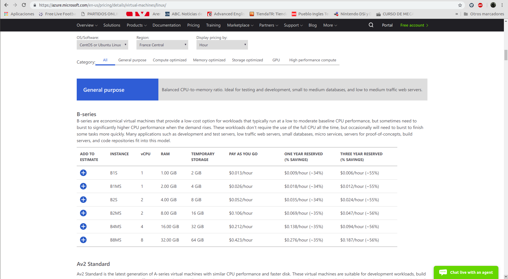
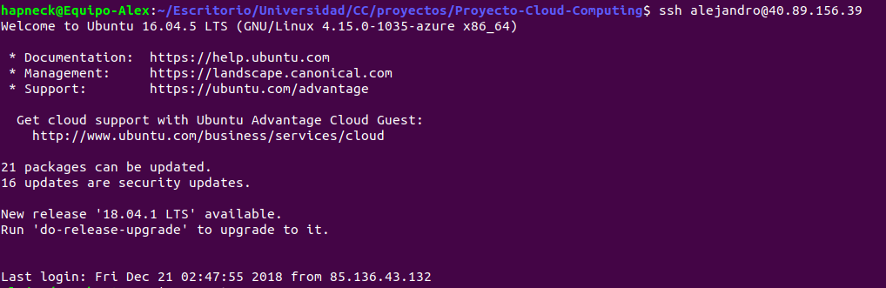

## Automatización en la creación de máquinas virtuales desde la línea de órdenes

---
MV2: 40.89.156.39

En este apartado hablaremos sobre cómo automatizar el proceso de creación de máquinas virtuales desde la línea de órdenes. Esto se realizará también desde Azure. Esta vez, se utilizará [Azure CLI](https://docs.microsoft.com/es-es/cli/azure/install-azure-cli-apt?view=azure-cli-latest) para poder desarrollar el script necesario. El motivo principal por el que sigo utilizándolo es porque tengo las suscripciones de los hitos anteriores y porque Amazon aún no me ha respondido por correo a la petición que realicé.

También realizaremos el provisionamiento automático de la máquina reutilizando el trabajo realizado con Ansible en el hito anterior. Esta es una parte opcional, pero la considero conveniente ya que realizamos todo el proceso de creación y de preparación de la máquina o máquinas virtuales ejecutando un único script.

### Mejoras realizadas en el proyecto

Al igual que en cada hito, se ha realizado una mejora en el proyecto, y no solo en su infraestructura. En esta ocasión he incluido un sistema de logs para registrar las peticiones realizadas en el servidor y tener un seguimiento de las acciones que se llevan a cabo en la base de datos de mongoDB.

Estos [cambios](https://github.com/AlejandroCN7/Proyecto-Cloud-Computing/commit/bf9bf3bd98348b271be1ce2814905465bb50a829) pueden apreciarse en los archivos [mongoDB.py](https://github.com/AlejandroCN7/Proyecto-Cloud-Computing/blob/master/mongoDB.py) y [principal.py](https://github.com/AlejandroCN7/Proyecto-Cloud-Computing/blob/master/principal.py). He utilizado la librería de Python llamada [logging](https://docs.python.org/3.6/library/logging.html) y he conseguido que se queden registradas en un archivo llamado "app.log" cosas como las que aparecen a continuación:

Como se puede observar, se abrió el servicio en modo local y en el puerto 5000. (En la máquina y con el puerto 80 funciona del mismo modo) y se comenzaron a realizar peticiones con curl.

Al inicio del servicio se intenta incluir una serie de jugadores en la base de datos en caso de que no estén. Esto fue una decisión mía con la finalidad de que siempre tuviera algo ahí para poder realizar pruebas.

Podemos ver como hacemos peticiones que comprometen a la base de datos y, por ello, también se activan mensajes relacionados con el mismo. Los logs relacionados con el servicio web añaden el código HTTP de la cabecera para saber el estado del paquete devuelto.

Una cosa que me gustaría mejorar en el futuro es el nombre de los logs por otros más significativos. Creo que se puede hacer desde la propia librería utilizada.

También se ha quitado la redirección de puertos y ya se puede usar el puerto 80 directamente.

### Automatización con Azure CLI y Ansible

Tal y como se especifica en este hito, se ha realizado en el script llamado [acopio.sh](https://github.com/AlejandroCN7/Proyecto-Cloud-Computing/blob/master/acopio.sh). Ahora pasaré a explicar el proceso que lleva a cabo y hablaré en mayor detalle de cada una de las decisiones tomadas que tuve que realizar y me parecieron relevantes tales como región del grupo de recursos, imagen de sistema operativo, etc.

### Localización de grupo de recursos

Decidí ponerlo de tal forma que fuese esa región por defecto en vistas futuras, ya que si necesitase crear más de una máquina no necesitaría especificar esto en cada grupo de recursos que crease.

Decir que en un principio quise especificar "francesouth" ya que se encuentra disponible cuando pongo `az account list-locations`. Sin embargo, a la hora de ejecutarlo, me encontré con que esa región concretamente no se encuentra disponible por algún motivo que desconozco:

Ahora voy a detallar las razones por las que elegí esa región y no otra distinta. Tal y como ha mencionado el profesor JJ en sus clases, la principal diferencia que tienen estas regiones son la latencia.

Entonces, lo más lógico es pensar que queremos una región que geográficamente se encuentre muy cercana a donde nos encontramos (Granada, España). Por consiguiente, me centré en esta idea para elegir la región.

Para saber si realmente la distancia a las regiones influía en la latencia, encontré la siguiente [página](http://www.azurespeed.com/) de Azure donde te permite realizar pruebas de latencia a muchas de las regiones que tiene disponibles:

Decidí poner solo 4 regiones para no saturar la imagen de información y que se pudiera observar bien. Las regiones que seleccioné son:

- **North Europe** (99 ms)
- **West Europe** (87 ms)
- **East US 2** (154 ms)
- **Japan East** (331 ms)

Aunque no pude probar las regiones francesas desde esa página, me sirvió para darme cuenta de que, cuanto más cerca estuviese la región, mejor era la latencia. Hubiese elegido el sur de Francia si no fuese por el problema que mencioné anteriormente, tuve que conformarme con Francia central.

### Creación de la máquina virtual

El siguiente paso, una vez se ha creado el grupo de recursos con la región que más nos conviene, es la creación de la máquina virtual.

En este punto, debemos de especificar la configuración de nuestra máquina. Incluí distintos tipos de información tales como:

- **Grupo de recursos**: El creado en el paso anterior.

- **Nombre**: El nombre de la máquina virtual para poder identificarla desde Azure.

- **Nombre del administrador**: Azure no permite mayúsculas en este nick. Puse "alejandro" y es el usuario con el que accedo a la máquina en el futuro por medio de SSH.

- **Generar las claves pública y privada SSH**: Esencial si quiero conectarme a la máquina directamente cuando este creada sin necesidad de contraseñas.

- **IP pública**: Como en pasos posteriores quiero provisionar de forma automática la máquina que estoy creando con Ansible. Este opción me será de utilidad.

- **Establer IP pública estática**: Es esencial, ya que si cada vez que enciendo y apago la máquina creada cambia esta IP, la IP que especifico en esta documentación no será válida la próxima vez que la encienda.

- **Tamaño**: Revisando las opciones que ponía a disposición Azure CLI, me percaté de este parámetro. Encontré información en este [enlace](https://azure.microsoft.com/en-us/pricing/details/virtual-machines/linux/). Básicamente, podemos especificar perfiles estándar del hardware (virtual) de nuestra máquina. De tal forma que ajustamos el coste de mantener la máquina a nuestras necesidades. Obviamente, no cuesta el mismo dinero mantener una máquina más potente que otra en el mismo intervalo de tiempo. Entonces, me fui a los perfiles de bajo coste directamente, ya que de momento mi proyecto no necesita mucha fuerza de procesamiento ni memoria y, de todas formas, esto es algo que puedo cambiar en el futuro si el volumen de mi proyecto cambia. Finalmente, me decante por la instancia llamada "B1S" la cual tiene una única CPU, 1GB de RAM y solo me cuesta 0,013$ la hora.

- **Imagen**: Este es un paso esencial. Hay que decirle a Azure que sistema operativo queremos que utilice la máquina para que pueda funcionar.

### Imagen seleccionada

 Llegados a este punto, comencé a deliberar cuál sería la imagen más apropiada para poner a funcionar mi proyecto. Por un lado, debemos de tener en cuenta las librerías y herramientas que utiliza nuestro proyecto. Por ello, debería de interesarnos una imagen que tuviese Python instalado por defecto y que soportase todas las librerías y módulos que este intérprete utiliza en nuestro proyecto.  Las imágenes de Windows no las contemplo directamente por no pertenecer a una licencia de Software Libre.

 Por otro lado, comencé a buscar información por Internet. Por ejemplo, según este [artículo](https://thishosting.rocks/debian-vs-ubuntu/). Los sistemas Debian Server son más apropiados para entornos empresariales ya que son más estables y seguros. No obstante, si lo que se busca es tener las últimas versiones de todo tipo de software y le damos un uso más personal (o académico), sería más apropiado una imagen de Ubuntu Server.

 Según este otro [artículo](https://www.hostinger.es/tutoriales/centos-vs-ubuntu-elegir-servidor-web/#gref), Ubuntu cuenta con la ventaja de que su centro de software tiene más de 40.000 aplicaciones disponibles, por lo que podemos encontrar todo tipo de funcionalidades ahí, que podamos necesitar para cualquier tipo de proyecto. Recibe actualizaciones frecuentes para eliminar cualquier error identificado.

 Por otra parte, CentOS también es considerada más estable que Ubuntu (al menos en esa referencia). El motivo principal es que las actualizaciones que mencionamos anteriormente son menos frecuentes, aunque yo personalmente lo veo más como una desventaja.

 Otra cosa interesante que se menciona es que Ubuntu tiene una comunidad más grande, lo que se traduce en una mayor cantidad de tutoriales, foros y libros para aprender a hacer casi cualquier cosa. Ubuntu Server tiene una gran cantidad de soporte para implementaciones en contenedores (cosa que se hará en el futuro) y en la nube, esto lo hace superior a CentOS y Debian en ese aspecto.

 CentOS es mejor a la hora de utilizar paneles de control para ofrecer servicios de alojamiento web. Se llega de nuevo a la conclusión de que si eres principiante es mejor elegir Ubuntu Server y si se trata de un proyecto empresarial se escoja CentOS.

 Finalmente, me decanté por utilizar una imagen de Ubuntu Server en mi máquina. Para decidir la versión de la misma. Me decanté por la 16.04 LTS ya que las versiones LTS tiene más años de soporte y mantenimiento.

### Apertura del puerto 80

Como ya se sabe del hito anterior. El profesor JJ nos indicó que quería que el servicio web escuchara por el puerto 80. Entonces, el siguiente paso lógico es la apertura de este puerto en la máquina para poder utilizarlo.

Para averiguar como podía hacerlo desde los comandos de Azure consulte su [documentación](https://docs.microsoft.com/es-es/azure/virtual-machines/linux/nsg-quickstart). Es realmente sencillo, con el comando `az vm open-port --resource-group myResourceGroup --name Ubuntu16 --port 80` es suficiente.

### Provisionamiento con Ansible

El objetivo del hito ya está conseguido; automatizar la creación y configuración de una o varias máquinas virtuales. No obstante, quise dar un paso más allá y realizar el provisionamiento de la máquina al igual que hice en el hito anterior. En un principio, pensé que con reutilizar el trabajo del pasado tendría el trabajo hecho. Para mi mala fortuna, tuve una serie de inconvenientes que, aunque son problemas tontos, hicieron que perdiera mucho tiempo en solucionarlos.

Para empezar, no podemos preconfigurar Ansible con la IP pública de la máquina, ya que no sabemos cual va a ser hasta que esté creada. Entonces, tenía que buscar la forma de averiguar la IP pública de la máquina que se acaba de crear dentro del script, para luego dársela a Ansible.

Tras un tiempo buscando en la documentación de Azure, encontré [esto](https://docs.microsoft.com/es-es/azure/virtual-network/virtual-network-deploy-static-pip-arm-cli) y me di cuenta de que podía cambiar la opción de output por el formato JSON. Tras investigar los campos de clave valor que tiene el comando `az network public-ip show   --resource-group myResourceGroup   --name myPublicIpAddress  --output json`, vi la clave "ipAddress" que tenía justamente la información que necesitaba.

Ahora, necesitaba la forma de aislar ese valor del resto de la salida del comando. Entonces busqué formas para manipular texto JSON desde el bash. Encontré [jq](https://www.systutorials.com/docs/linux/man/1-jq/), un comando con el que podía sacar el valor de esa clave. Entonces, mi comando quedó finalmente de esta forma:

    IP=`az network public-ip show   --resource-group myResourceGroup   --name myPublicIpAddress  --output json | jq ".ipAddress"`

Sin embargo, otro de los problemas con los que me topé son las doble comillas. En mi variable tenía la IP pública de la variable envuelta en dobles comillas, para quitarla utilice este comando dos veces seguidas (sustituyo las dobles comillas por cadena vacía y listo):

    IP=`echo ${IP/\"/}`
    IP=`echo ${IP/\"/}`

Finalmente, podemos realizar el provisionamiento de Ansible. Para no tener la necesidad se poner el script en el mismo lugar que tenia el provisionamiento (donde se encuentra Ansible.cfg), establecí la configuración por medio del propio comando indicando el inventario (la IP pública de la máquina y el usuario) y que no hiciera comprobación de las claves del host tal y como se aprecia:

`ansible-playbook -i "$IP," -e 'host_key_checking=False' -b provision/azure/playbook.yml --user alejandro -v`

Es importante dar permisos de ejecución al script con chmod, de lo contrario no funcionará correctamente. Al no tener el archivo ansible.cfg no me di cuenta hasta que le aplique el verbose al provisionamiento, pero tenía el problema que JJ mencionó una vez en clase.

No me dejaba conectarme a la máquina por SSH debido a que tenía sospechas de ataque man in the middle. Si nos pasa esto, la forma de solucionarlo es borrar ~/.ssh/known_hosts. Al menos, a mí me funcionó. Es algo que te hace emplear mucho tiempo en averiguar el problema, pero que al mismo tiempo te ayuda a aprender.

Podemos ver el acceso a la máquina y que el servicio funciona en los siguientes pantallazos:

