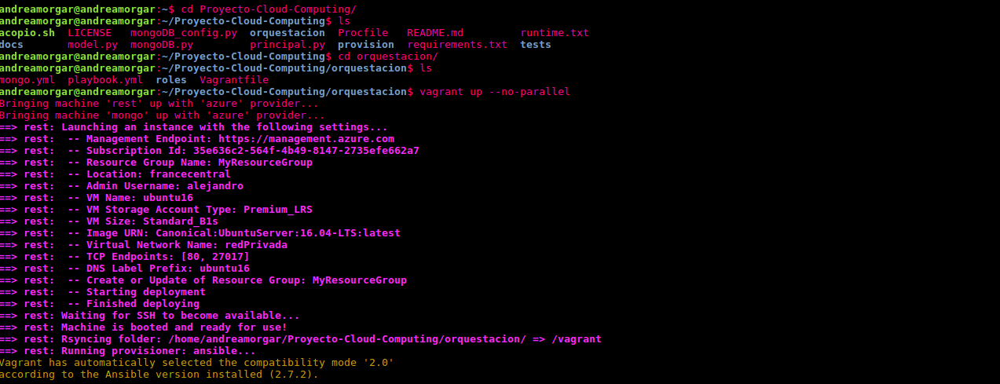
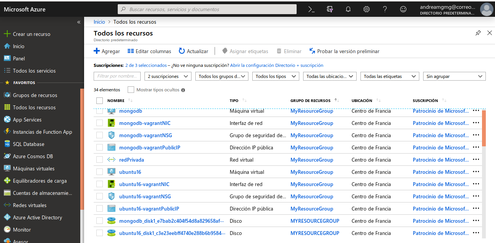
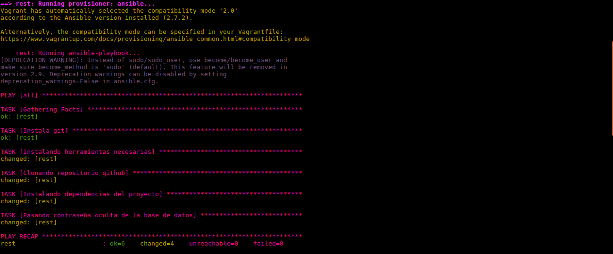
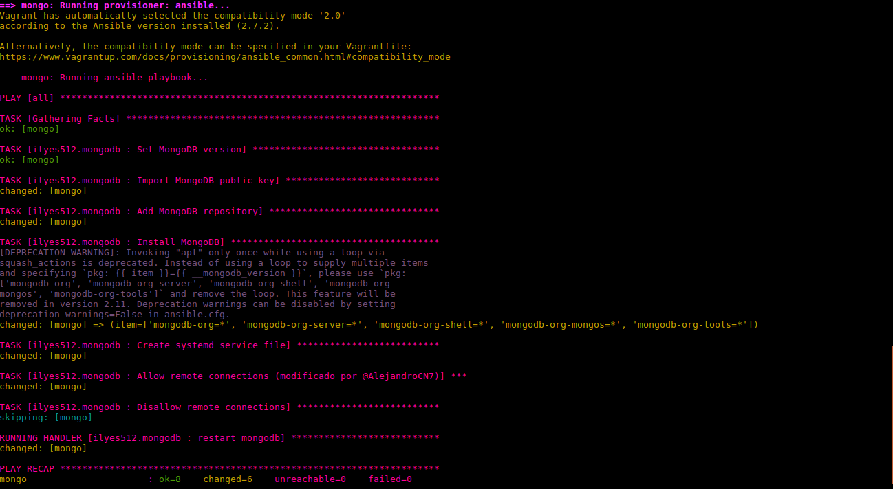
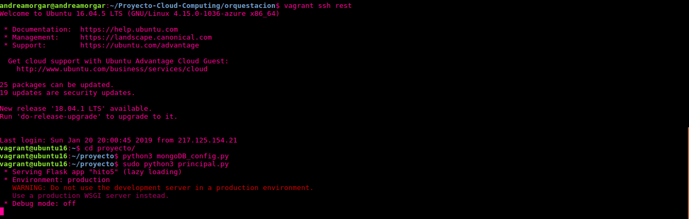
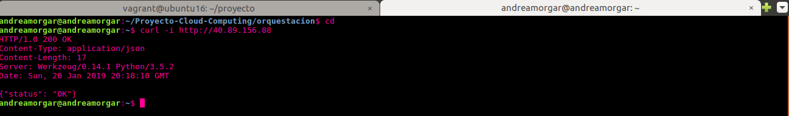
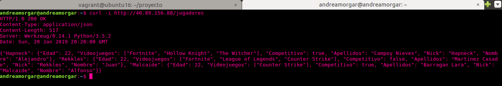
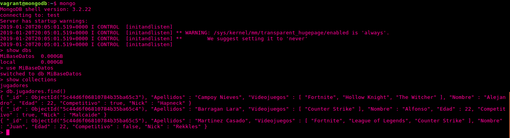
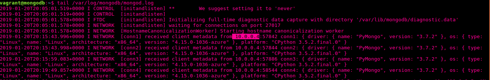
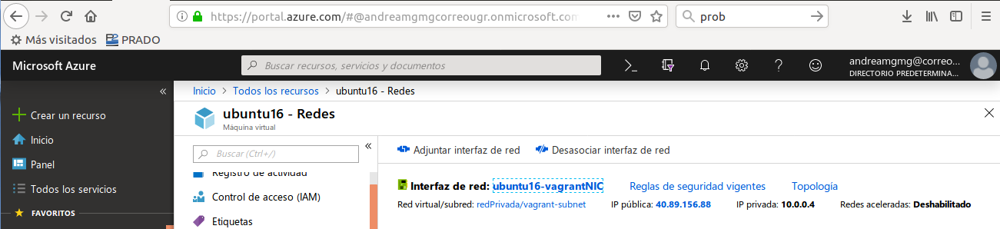

# Comprobación del funcionamiento correcto del sistema de Provisionamiento

**Realizado por: Andrea Morales Garzón (@andreamorgar)**

**Para: Alejandro Campoy Nieves (@AlejandroCN7)**

---

Para probar el provisionamiento de las máquinas que ha realizado @AlejandroCN7, he comenzado por realizar un Fork y su posterior `git clone` del proyecto, para así disponer de todos sus ficheros y poder realizar todo el procedimiento desde mi ordenador personal.

En primer lugar, accedemos al directorio `/orquestacion`, y lanzamos, mediante la orden `vagrant up --no-parallel` la creación de las máquinas virtuales. Podemos apreciar como comienza la creación de las máquinas en la siguiente imagen.

Además, de la forma que Alejandro ha realizado la creación de las máquinas en el Vagrantfile,  les ha añadido que se lleve a cabo también su provisionamiento desde Ansible, por lo que, una vez acabe la ejecución de la orden anteriormente comentada, tendremos las máquinas virtuales listas para usarlas. A continuación podemos ver una imagen de mi cuenta de Azure, donde se muestran todos los recursos creados como consecuencia de la ejecución del fichero Vagrantfile.

Al haber realizado la ejecución con la opción `--no-parallel`, primero se creará una de las máquinas, y a continuación, la restante. Como la salida de la ejecución de la orden es muy extensa, simplemente me voy a limitar a mostrar cómo realmente finaliza el provisionamiento de cada una de las máquinas sin ningún fallo. En la siguiente imagen, podemos ver cómo el provisionamiento de la máquina que alojará el servicio rest finaliza correctamente.

De igual forma, podemos ver en la imagen mostrada a continuación cómo el provisioniento de la segunda máquina también se realiza de la manera esperada.

Una vez finaliza el segundo provisionamiento, ya tenemos las máquinas listas para su uso. Accedo por ssh a la primera de ellas, que es la que aloja la aplicación. En la imagen que se facilita a continuación podemos ver la ejecución del proyecto (posterior a la ejecución de un script que añade información a la base de datos, de forma que al probarla no esté vacía).

Si desde otra terminal probamos su funcionamiento en la ruta raíz, podemos ver que se ejecuta sin problema tal y como se puede observar a continuación:

Sin embargo, como con esta ruta no se está probando que accede a la base de datos de la otra máquina, voy a ejecutar una ruta que sé que sí accede a dicha base de datos, tal y como se muestra en la siguiente imagen.

Si ahora accedemos por ssh a la máquina que aloja mongo, y consultamos la base de datos, (en concreto la colección utilizada), podemos ver que contiene dicha información, tal y como se ve a continuación:

Es más, podemos consultar el **archivo de logs**, con los últimos logs generados por Mongo, y efectivamente podemos ver que se está accediendo desde la IP de la máquina que contiene el servicio REST. A continuación se muestra la imagen con el contenido de los logs en cuestión.

Podemos comprobar, que se corresponde efectivamente con la IP interna de la máquina con el servicio REST en la siguiente imagen.

