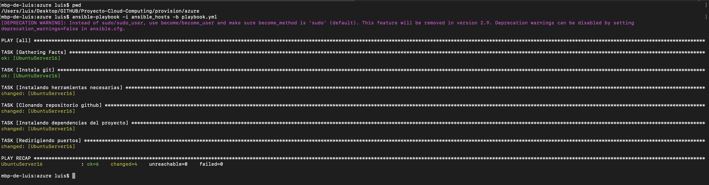
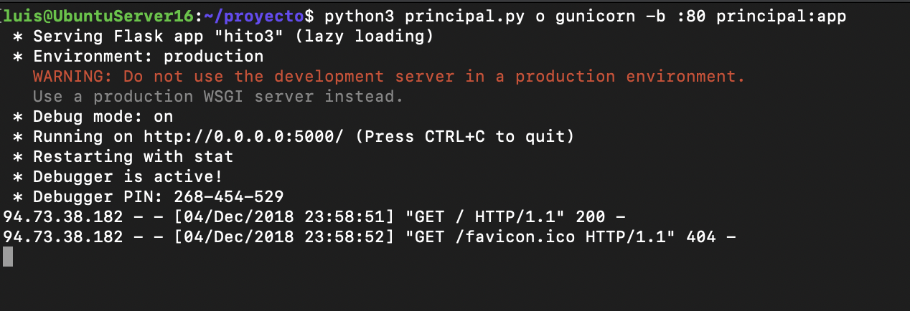
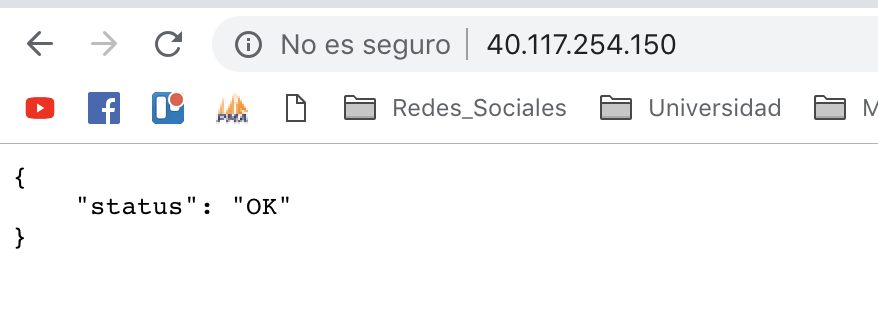
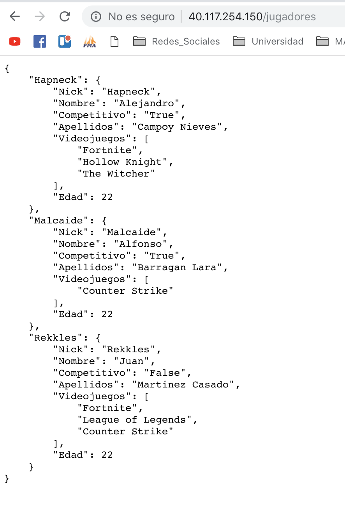

# Comprobación del provisionamiento de otro proyecto

Realizado por @lgaq94.

Para comprobar que el provisionamiento del proyecto de Alejandro funciona correctamente el primer paso ha sido realizar un fork y un clone de su Github. Una vez que lo tenía en mi maquina local, he cambiado localmente su archivo *ansible_hosts* para adaptarlo a mi máquina de *Azure*.

Tras este pequeño cambio ya estaba listo para desplegar en mi máquina virtual, para ello he hecho uso de la instrucción de *Ansible* que he utilizado continuamente en mi proyecto, obteniendo un resultado favorable como podemos ver en la siguiente captura:

Ya tan solo nos queda ejecutar su proyecto para comprobar si el funcionamiento es el correcto. Para ello hemos realizado lo siguiente:
~~~
python3 principal.py o gunicorn -b :80 principal:app
~~~

Como podemos ver en la siguiente imagen obtenemos un status: Ok por lo que concluimos que el provisionamiento realizado es correcto. Además, para finalizar mostramos uno de los recursos de su aplicación a través de GET.

