## Contenedores para despliegue en la nube

---
Contenedor: 13.83.23.239

En este hito, vamos a hacer el despliegue de nuestro proyecto utilizando para ello contenedores [Docker](https://www.docker.com/). Para poder manejar las distintas imágenes que vamos a probar y ver en esta documentación, haremos buen uso de la [línea de ordenes docker](https://docs.docker.com/engine/reference/commandline/cli/). De esta forma podremos crear nuestras propias imágenes o descargarlas de Internet para usarlas en nuestros posteriores contenedores. Junto con muchas más funcionalidad que nos permite visualizar las imágenes almacenadas localmente, eliminarlas, crear contenedores para ellas, etc.

La idea que he seguido es la de alojar la imagen producida a través de un Dockerfile propio a [Docker Hub](https://hub.docker.com/). Una vez subida ahí, es fácil poder descargarse nuestra imagen desde Internet y lo utilizamos para poder indicársela a Azure para poder desplegarla fácilmente. El repositorio que he creado es https://cloud.docker.com/u/alejandrocn7/repository/docker/alejandrocn7/proyecto_cloud_computing para subir mis imágenes.

Destacar que este ha sido el hito al que he dedicado menor tiempo, debido a que necesito ese tiempo para otras asignaturas. He tratado de centrar mis esfuerzos en el manejo básico de esta herramienta, en saber la diferencia entre las imágenes y los contenedores como tal, saber la estructura básica  de un Dockerfile para poder montar nuestras propias imágenes, etc. Todo de una forma genérica para poder tener una vista amplia de cara al futuro. Al final comentaré algunas mejoras que podría llevar a cabo del trabajo realizado en este hito.

### Docker y Docker Hub

Lo primero que hice fue realizar la instalación de la línea de ordenes de Docker y aprender su uso básico. para ello utilice los [apuntes y referencias de JJ](http://jj.github.io/CC/documentos/temas/Contenedores) sobre este tema y me fueron de gran ayuda. Configuré mi sistema para que mi usuario pueda utilizar Docker sin permisos de administrador (sin el uso de sudo). Lo siguiente que hice fue crearme un usuario en Docker Hub, vincular la cuenta con mi Github y hacer login desde la línea de ordenes para tener acceso a Docker Hub desde ella.

Con los apuntes anteriormente mencionados estuve informándome de alguna de las posibilidades que ofrece esta línea de ordenes a la hora de trabajar con imágenes y contenedores. Estuve buscado por Docker Hub distintas imágenes como, por ejemplo, Ubuntu, Debian o CentOS. Me fui descargando estas imágenes localmente usando el comando `docker pull <Nombre de la imagen>:<tag>`. Como dijo JJ en clase, también es posible obtener imágenes mucho más ligeras y que tienen todo lo que necesitamos para ejecutar nuestro proyecto. Por ello es que estuve buscando y encontré imágenes de Alpine y otra llamada photon. Al parecer son dos OS's ligeros basados en Linux. Al final acabé quedándome con Alpine ya que posteriormente encontré una imagen que incluía python3 y en photon no. Además, JJ menciona Alpine en sus apuntes y quería investigar sobre el mismo; en sus apuntes dice que esta distribución ligera esta precisamente dirigida a su uso dentro de contenedores.

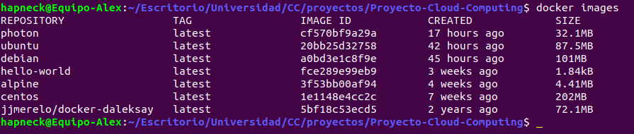

Vemos que Alpine y photon son las distribuciones más ligeras con 4.41MB y 32.1MB respectivamente. Aquí comencé a entender el sentido de todo esto: ¿necesito una distribución entera tal como Ubuntu, por ejemplo, para poder ejecutar mi proyecto? Alpine es mucho más ligero y si funciona ahí ahorro una gran cantidad de recursos y esfuerzo. Me hubiera gustado estudiar de una forma más detallada las imágenes que podía usar, pero vuelvo a repetir que no cuento con más tiempo.

#### Dockerfile

Finalmente, me decanté por usar [Alpine](https://alpinelinux.org/) (borré el resto de imágenes usando `docker rmi <nombre_imagen o ID>`). En esos simples 4.41MB de espacio supuse que no tenía Python3 instalado, cosa que me hacía falta para poder ejecutar mi proyecto (junto con las dependencias). El caso es que tenía claro que debía partir de esa imagen para construir la mía propia en la que hubiera solamente lo que yo necesitase. Supongo que este es uno de los sentidos que tiene los contenedores también.

Para definir mi propia imagen he creado mi propio [Dockerfile](https://github.com/AlejandroCN7/Proyecto-Cloud-Computing/blob/master/Dockerfile). De lo primero que quise enterarme es de la estructura que tiene estos archivos y de las cosas que se pueden hacer dentro del mismo. [Aquí](https://www.digitalocean.com/community/tutorials/docker-explicado-como-crear-contenedores-de-docker-corriendo-en-memcached-es) encontré información específica sobre los comandos que podía utilizar dentro de un Dockerfile.

Desde ese enlace me di cuenta que con FROM puedo indicar la imagen base para usar. Por lo que busqué un Alpine que tuviera ya python3 instalado (eso que me ahorro de especificar en el Dockerfile), y encontré [este](https://hub.docker.com/r/frolvlad/alpine-python3). Por lo que me lo descargué:

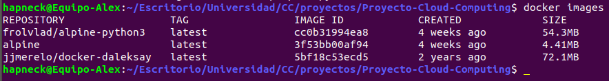

Vemos que esta imagen, a pesar de que sigue siendo Alpine, pesa bastante más. Considero que es normal ya que tiene Python3 instalado de serie.

La idea es partir con FROM de esa imagen y no de Alpine estándar y de esa forma tengo que especificar menos cosas en el Dockerfile. Lo siguiente que quería hacer era llevarme los archivos necesarios de mi proyecto dentro de la imagen. Para ello ví en la referencia mostrada que podía usar tanto COPY como ADD. No sabía muy bien cual era la diferencia entre ambas y lo pregunté en clase. Darle las gracias a [JJ](https://github.com/JJ), que me facilitó [este enlace](https://nickjanetakis.com/blog/docker-tip-2-the-difference-between-copy-and-add-in-a-dockerile) por el grupo de clase de Telegram y me ayudó a entender la diferencia entre ambos comandos del Dockerfile. Como estoy usando archivos locales de mi PC, es más apropiado usar COPY.

También me di cuenta de que podía especificar el directorio de trabajo con WORKDIR y especifique la carpeta ~/proyecto/ para hacerlo de la misma forma que en el resto de hitos. De esta forma no tenía la necesidad de especificar esa ruta en cada uno de los COPY's que hacía.

En la referencia me percaté de que EXPOSE sirve para exponer un puerto al exterior, por lo que deducí que tenía que poner el puerto 80 ahí para que un cliente pudiera comunicarse con el futuro contenedor en ejecución.

Como un contenedor está pensado para ejecutar una única cosa, JJ me desaconsejó el tener MongoDB instalado en el mismo contenedor. En realidad entiendo eso, ya que es más propio de un sistema monolítico que del propósito y para lo que esta pensado un contenedor. Por ello he utilizado mlab para dar ese servicio desde el contenedor, ya que solo tendría que comunicarse con mi cuenta.

Para que mi aplicación supiera que debía de conectar con mlab (no en local como hace Travis o a una máquina de Azure en una misma red virtual como hacía en el hito anterior), me declaré una variable de entorno en el Dockerfile usando ENV llamada MLAB. Con ello mi aplicación sabe que tiene que comunicarse con el servicio de mlab.

En este punto me encontré con otro problema. Debía de especificar la contraseña que tenía mi cuenta para poder comunicarme con el servicio. Pero, como es obvio, no quería poner mi contraseña en el código ni declarar una variable de entorno en el Dockerfile con la contraseña, ya que sigue viéndose la contraseña solo que en un archivo distinto, lo cual no me saca del problema.

Estuve buscando por Internet. la idea que tenía en mente era poder especificar la variable de entorno con el contenido de la contraseña en el momento de la construcción del contenedor, no en el momento de la construcción de la imagen, de tal forma que solo se viera en la línea de ordenes de mi pantalla. Finalmente encontré esto:

`docker run -e <Variable de entorno>=<valor> ...`

Pero no adelantemos acontecimientos. Después simplemente me instalé las dependencias de mi [requirements.txt](https://github.com/AlejandroCN7/Proyecto-Cloud-Computing/blob/master/requirements.txt) con pid3. Según la referencia, RUN está pensado para ejecutar cosas que influyen al resultado de la imagen final. CMD lo utilicé para indicar el comando que quería que se ejecutase una vez se creara el futuro contenedor y he ejecuto gunicorn para iniciar el servicio por el puerto 80 tal y como llevo haciendo en hitos anteriores.

Con esto he terminado de explicar la construcción de mi Dockerfile.

#### Utilización del Dockerfile

Una vez creado el Dockerfile, podemos crear localmente la imagen resultante poniendo:

`docker build -t <Nombre de la imagen que queramos> .`

Importante el punto final ya que le indicamos la ruta en la que tiene que buscar el Dockerfile (en nuestro caso, el repositorio en el que nos encontramos en ese momento). En la terminal aparecerá información de que el proceso ha ido bien.

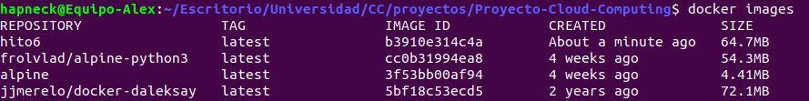

Como podemos ver hemos aumentado el tamaño de la imagen de 54.3MB a 64.7MB. Lo cual es normal debido a la importación de nuestros archivos para el proyecto y las dependencias que hemos instalado para que pueda ejecutarse el servicio correctamente.

Podemos probar que funciona correctamente de la siguiente forma:

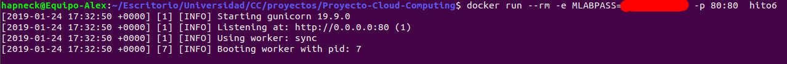
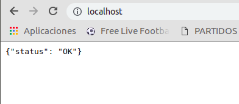
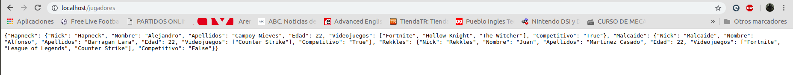
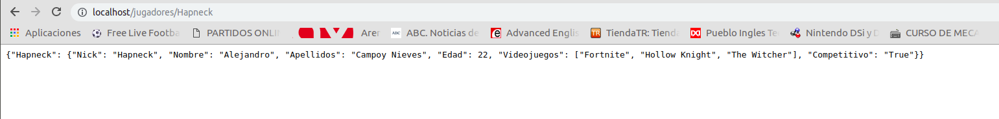

Como podemos ver, el contenedor que se crea a partir de la imagen "hito6" funciona perfectamente. La opción -e es para especificar la variable de entorno que lleva la contraseña fuera del Dockerfile (he censurado la contraseña). la opción --rm es utilizada para que el contenedor se elimine una vez termine de ejecutarse, si lo viéramos con `docker ps -a` veríamos que no tenemos el contenedor localmente en nuestro sistema. La opción -p (--publish) la utilizamos para publicar el puerto 80 del contenedor en el puerto 80 de nuestro host (es como redirigir el puerto 80 del contenedor al puerto 80 de nuestro host). De esta forma podemos acceder al servicio como localhost desde nuestro navegador como se ve en las capturas.

Vemos que las variables de entorno han sido creadas correctamente dentro del contenedor utilizando la opción -it (censurando la contraseña):

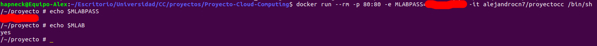

#### Subir la imagen resultante a Docker Hub

Para ello he utilizado el comando:

`docker tag hito6:latest alejandrocn7/proyecto_cloud_computing:latest`

`docker push alejandrocn7/proyecto_cloud_computing:latest`

Tras esto ya tenemos nuestra imagen subida y es accesible por Internet. El siguiente paso es desplegar un contenedor en Azure que la utilice.

### Despliegue en Azure

Estuve investigando en como desplegarlo y encontré el recurso Azure Container Instances:

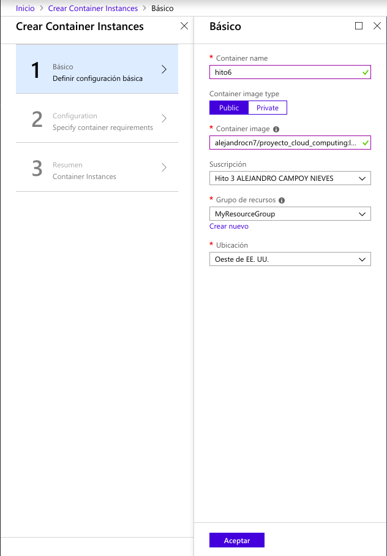
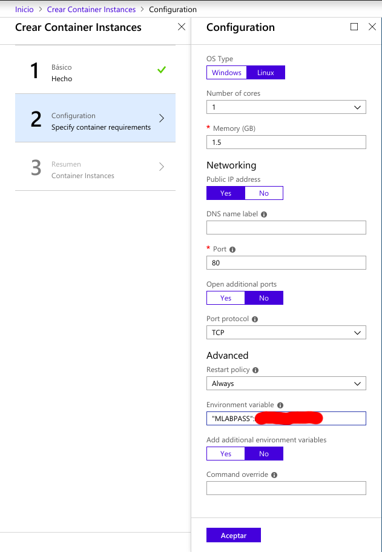
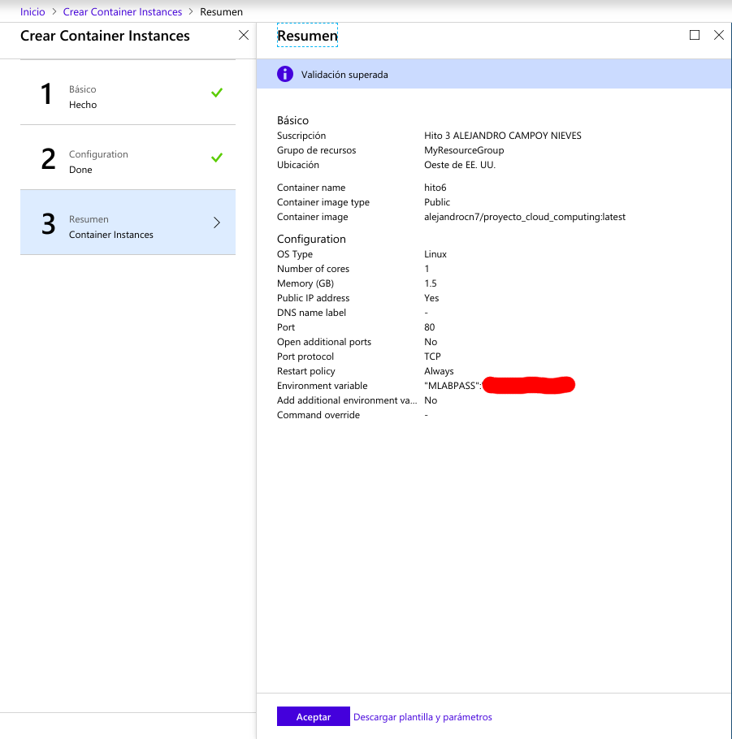

Lo que destacaría de este proceso es que la imagen la seleccionamos indicando nuestro repositorio de Docker Hub y el tag, es decir, "alejandrocn7/proyecto_cloud_computing:latest". El nombre del contenedor puede ser el que queramos y especificamos la variable de entorno MLABPASS en la creación del contenedor. Sería equivalente a la opción -e en la línea de comandos de Docker cuando creabamos el contenedor localmente.

Finalmente, aparecerá el contenedor en nuestro Azure. Consultamos la IP pública que tiene y probamos si el servicio está funcionando correctamente.

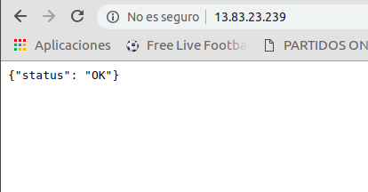
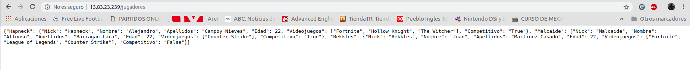
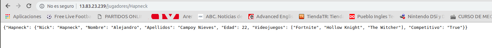

### Posibles mejoras para el futuro

He utilizado mlab con el propósito de tener un solo Docker y no tener que meterme con temas de redes y comunicar bien dos contenedores aislados con el servicio REST por un lado y el servicio de la base de datos por el otro. Sería interesante hacer esto en el futuro con más tiempo por delante.
